# Pokédex - Vue Edition

https://www.figma.com/community/file/979132880663340794/pokedex

Om alle concepten van Vue aan te leren, zal er doorheen het opleidingsonderdeel een Pokédex-applicatie worden gebouwd. Deze applicatie zal elk hoofdstuk verder worden uitgebreid met nieuwe functionaliteiten en concepten.

| Overizchtspagina                                | Detailpagina                                  |
| ----------------------------------------------- | --------------------------------------------- |
| 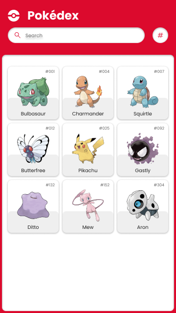 | 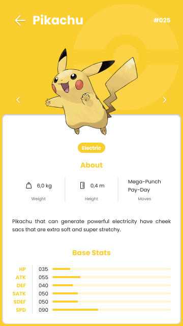 |

## Inleiding

### Startbestanden

De GitHub Classroom assignment bevat een Vue-project met de nodige startbestanden. Dit project bevat:

- Een project gegenereerd met `npm create vue@latest` (Vue 3 + Vite, met JavaScript, Vue Router, Pinia, ESLint en Prettier).
- Een map `assets/` met daarin een `main.css`-bestand voor globale styling, hierin is een CSS Reset voorzien en algemene styling voor de body. Dit is ook al gekoppeld in `main.js`.
- Een map `layouts` met hierin een `MainLayout.vue`-bestand.
- Een map `views` met hierin componenten die een pagina voorstellen. Deze views bevatten momenteel enkel een `h1`-element en een `p`-element.
- Een map `router` met daarin een `index.js`-bestand waarin de layout al gekoppeld is, maar de views nog niet.

### TypeScript

Er wordt in dit project geen gebruik gemaakt van TypeScript. Toch wordt er aangeraden om in een `.vue`-bestand de `lang="ts"`-property toe te voegen aan de `<script setup>`-tag. Dit zorgt ervoor dat er in de editor betere autocompletion en type-checking is, ook al wordt er met JavaScript gewerkt.

Bijvoorbeeld het importeren van Vue Composables zoals `ref`, `computed`, ... zal automatisch kunnen gebeuren wanneer `lang="ts"` is toegevoegd. Dit kan door `Cmd + .` (MacOS) of `Ctrl + .` (Windows) op de importregel te gebruiken en vervolgens te kiezen voor `Add import from 'vue'`.

Bijvoorbeeld:

```html
<script setup>
  import { ref } from 'vue'; // deze regel is manueel toegevoegd

  const message = ref('Hello, World!');
</script>
```

```html
<script setup lang="ts">
  import { ref } from 'vue'; // Deze import is automatisch toegevoegd

  const message = ref('Hello, World!');
</script>
```

### Data

De data is gebaseerd op de [PokéAPI](https://pokeapi.co/). Eerst zullen er enkele statische gegevens worden gebruikt, daarna wordt er overgeschakeld op hard-coded objecten die de data van de API voorstellen. Uiteindelijk zal er gebruik worden gemaakt van State Management waarin de data wordt teruggegeven als `promise` om een realistische API-call na te bootsen. En ten slotte zal er echte data van de PokéAPI worden opgehaald.

### Design

Er wordt gebruik gemaakt van een design dat publiek beschikbaar is op [Figma](https://www.figma.com/community/file/979132880663340794). De focus van de oefeningen ligt op het bouwen van de functionaliteiten en het gebruik van Vue, gebruik het design als leidraad voor de opmaak en styling van de applicatie. Het is niet nodig om het design pixel-perfect na te bouwen (mag wel, voor de mensen die een extra uitdaging zoeken).

Het is ook voldoende om enkel de `mobile design`-weergave te implementeren. Het is niet nodig om een `desktop design`-weergave te maken.

De browser kan ingesteld worden op een viewport van 360x640 pixels om het mobiele ontwerp beter te kunnen bekijken tijdens het ontwikkelen.

#### Styleguide

Gebruik de "Style Guide"-sectie in Figma als referentie voor de gebruikte kleuren.

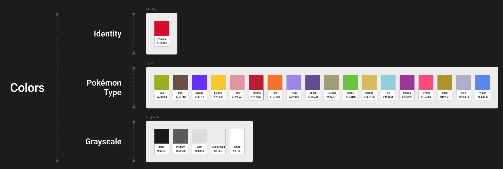

> **Tip**: Maak gebruik van CSS-variabelen in `main.css` om de kleuren van de styleguide op te slaan en te gebruiken in de verschillende locaties van de applicatie.

`assets/main.css`

```css
* {
  box-sizing: border-box;
  padding: 0;
  margin: 0;
}

:root {
  --type-bug: #a7b723;
  --type-dark: #75574c;
  --type-dragon: #7037ff;
  --type-electric: #f9cf30;
  --type-fairy: #e69eac;
  --type-fighting: #c12239;
  --type-fire: #f57d31;
  --type-flying: #a891ec;
  --type-ghost: #70559b;
  --type-normal: #aaa67f;
  --type-grass: #74cb48;
  --type-ground: #dec16b;
  --type-ice: #9ad6df;
  --type-poison: #a43e9e;
  --type-psychic: #fb5584;
  --type-rock: #b69e31;
  --type-steel: #b7b9d0;
  --type-water: #6493eb;

  --color-primary: #dc0a2d;
  --color-background: #efefef;

  --color-grayscale-white: #ffffff;
  --color-grayscale-light: #e0e0e0;
  --color-grayscale-medium: #666666;
  --color-grayscale-dark: #212121;
}

body {
  font-family: 'Roboto', sans-serif;
  background-color: var(--color-background);
  color: var(--color-grayscale-dark);
}
```

#### Screens

Gebruik de "Screens"-sectie in Figma als referentie voor het ontwerp van de verschillende pagina's.

| Overzichtspagina                                | Detailpagina 1                                    | Detailpagina 2                                      | Detailpagina 3                                  |
| ----------------------------------------------- | ------------------------------------------------- | --------------------------------------------------- | ----------------------------------------------- |
|  | 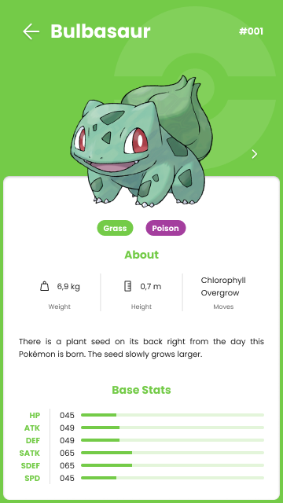 | 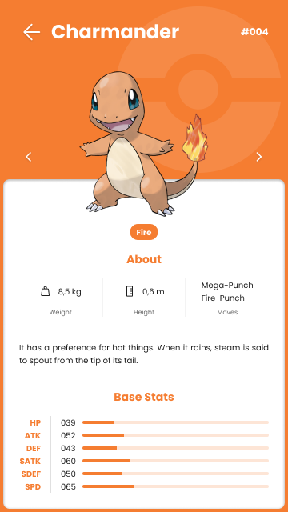 | 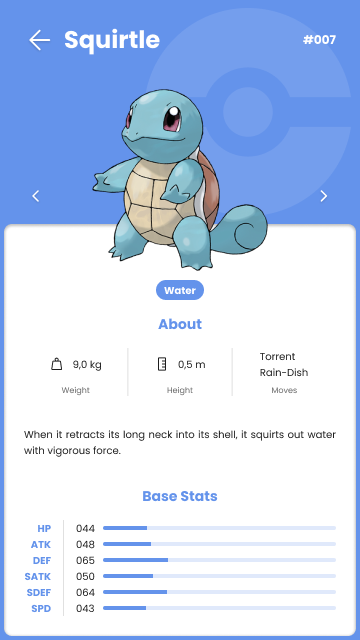 |

## Layout & Views (8 uur)

In principe is er geen nood aan meerdere layouts voor deze applicatie. Toch zal er een `MainLayout` voorzien worden, zodat er in de toekomst makkelijk extra layouts kunnen worden toegevoegd indien nodig.

De applicatie zal één layout hebben die gebruikt wordt voor alle pagina's, deze layout zal enkel een `<router-view>` bevatten waar de verschillende views in geladen worden. Er is geen vaste header of footer voorzienin het design.

De setup momenteel is:

- `App.vue`: Het hoofdcomponent, waarin de `router-view` children zal renderen.
- `layouts/MainLayout.vue`: De hoofdlayout voor de applicatie. Dit is het child dat gerenderd wordt in `App.vue`. In deze layout staat opnieuw een `router-view` waarin de children gerenderd zullen worden (de verschillende views).
- `views/`: De componenten waar de verschillende pagina's van de applicatie zich bevinden.

- **App**: Het hoofdcomponent van de applicatie: waarin de layouts worden geladen.
  - **MainLayout**: De hoofdlayout waarin andere views worden geladen:
    - **ListView**: Een overzicht van alle Pokémon met basisinformatie, zoals naam en afbeelding.
    - **DetailView**: Een gedetailleerde pagina voor elke Pokémon met uitgebreide informatie, zoals `types`, `stats`, ...

### Routing

Gebruik Vue Router om de verschillende views te beheren en de juiste layout toe te passen op basis van de route. Denk na over welke layout en view **eagerly loaded** moeten worden en welke **lazily loaded** kunnen worden om de prestaties van de applicatie te optimaliseren.

De volgende routes moeten worden ingesteld in Vue Router:

- `/`: Toont de **ListView** binnen de **MainLayout**.
- `/pokemon/:id`: Toont de **DetailView** voor een specifieke Pokémon binnen de **MainLayout**.

De pagina's bevatten momenteel enkel een `h1`-element en een `p`-element als placeholder.

<details>
  <summary>Hint - eagerly vs lazily loaded</summary>

De MainLayout en de ListView worden als eerste ingeladen omdat dit de hoofdpagina is die gebruikers zien. Deze zullen dus **eagerly loaded** worden.

Al de andere views kunnen **lazily loaded** worden omdat ze niet onmiddellijk nodig zijn bij het laden van de applicatie. Dit helpt om de initiële laadtijd van de applicatie te verminderen.

</details>


### ListView

Style de **ListView** volgens het design in Figma. De afbeeldingen zoals de bal in de header kunnen geëxporteerd worden vanuit Figma (klik het element aan in Figma, in de zijbalk aan de rechterkant kan er op `Export` geklikt worden om het element te exporteren als PNG).

De afbeelding kan in `assets/` geplaatst worden, bijvoorbeeld in de map `assets/img/`. Deze kan vervolgens in de `template` gekoppeld worden via ``.

<details>
  <summary>Hint - algemene layout in CSS</summary>

```html
<div class="list-view">
  <header>
    <h1>Pokédex</h1>
  </header>
  <main>
    <p>Overzicht van alle Pokémon komt hier.</p>
  </main>
</div>
```

```css
.list-view {
  height: 100vh;
  background-color: var(--color-primary);
  padding: 0.5rem;

  display: flex;
  flex-direction: column;
}

main {
  background-color: var(--color-grayscale-white);
  border-radius: 8px;
  padding: 1rem;
  flex-grow: 1;
}
```

Door de `list-view` als een flex container in te stellen en de `flex-direction` op `column` te zetten, worden de header en main onder elkaar geplaatst. Met `height: 100vh` wordt ervoor gezorgd dat de container altijd de volledige hoogte van het scherm inneemt.

De `main`-sectie krijgt met `flex-grow: 1` de resterende ruimte in de container, waardoor deze zich uitstrekt om de beschikbare ruimte op te vullen.

</details>

| Algemene layout                                                    | Met header uitgewerkt                                            |
| ------------------------------------------------------------------ | ---------------------------------------------------------------- |
| 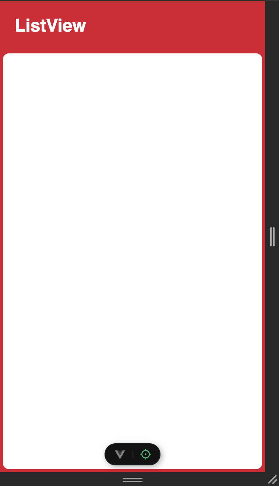 | 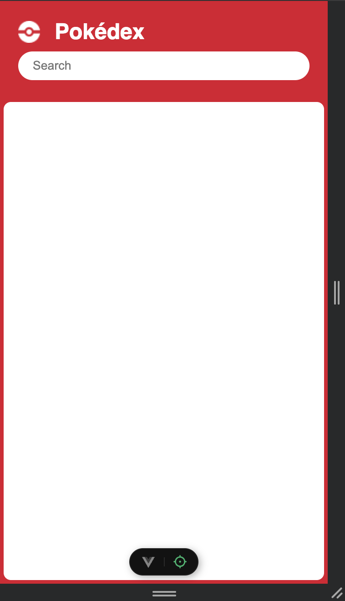 |

De **ListView** toont een lijst van alle Pokémon. Elke Pokémon wordt weergegeven met zijn naam en afbeelding. De lijst mag momenteel hard-coded HTML zijn. De styling mag gebeuren in de style-tag van de ListView zelf.

De informatie:

- bulbasaur
- charmander
- squirtle
- pikachu

Elke afbeelding kan worden gevonden via de volgende URL-structuur: `https://img.pokemondb.net/sprites/home/normal/2x/avif/{name}.avif`, waarbij `{name}` de naam van de Pokémon is. De afbeelding zal er anders uitzien dan de afbeeldingen in Figma, dit is oké.

bv.

- Bulbasaur: `https://img.pokemondb.net/sprites/home/normal/2x/avif/bulbasaur.avif`
- Charmander: `https://img.pokemondb.net/sprites/home/normal/2x/avif/charmander.avif`
- Squirtle: `https://img.pokemondb.net/sprites/home/normal/2x/avif/squirtle.avif`

Merk op dat de pagina horizontaal scrollbaar wordt wanneer de lijst te lang is. Om dit te vermijden kan er met `overlow-y: auto` gewerkt worden op het element dat de lijst bevat. Dit zorgt ervoor dat er een scrollbalk verschijnt in het element zelf, waardoor de pagina zelf altijd `100vh` hoog blijft. De header zal nu ook altijd zichtbaar zijn, zonder dat er met `position: fixed` of `position: sticky` moet gewerkt worden.

| Zonder overflow-y:auto                                                      | Met overflow-y:auto                                                                       |
| --------------------------------------------------------------------------- | ----------------------------------------------------------------------------------------- |
| 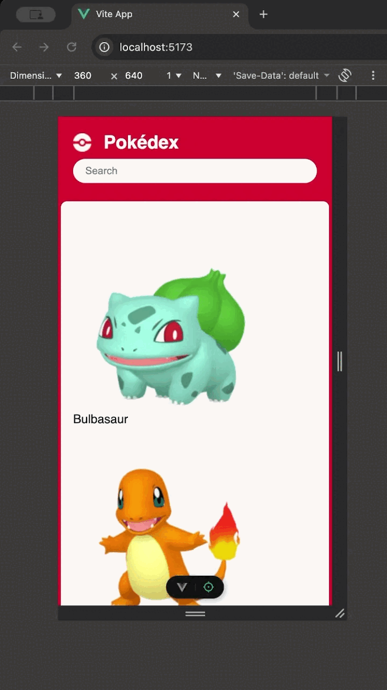 | 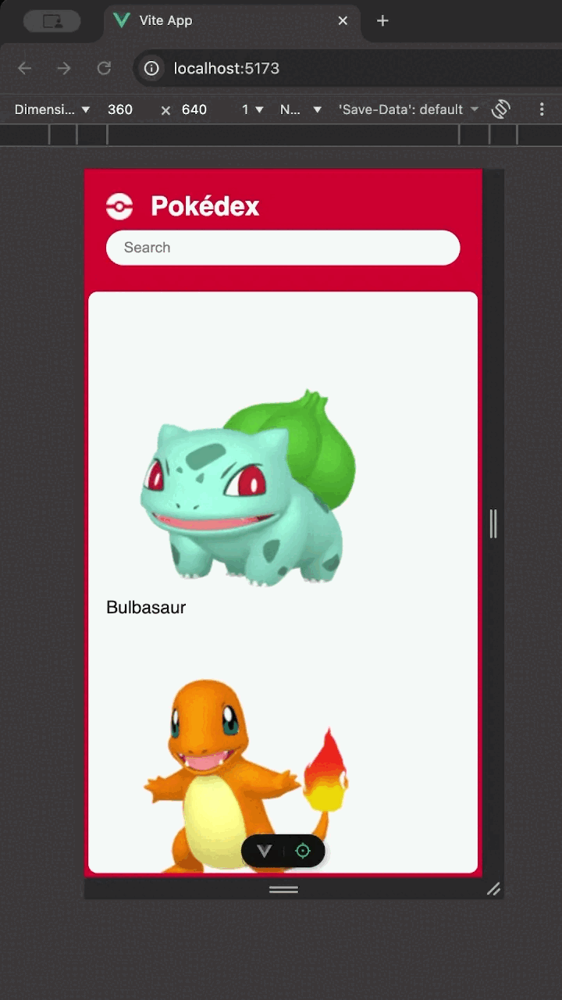 |

Zorg ervoor dat elke pokémon in de lijst wordt weergegeven zoals in het design, het is niet nodig om het nummer in de rechterbovenhoek toe te voegen. Bij het gebruik van `display: flex` voor de items in de lijst, is het gedrag van de items raar, elk item wordt uitgerokken. Dit komt doordat de container een hoogte ingesteld heeft, hierdoor nemen de items de volledige hoogte in van de rij. Om dit op te lossen kan er `align-content: flex-start` toegevoegd worden aan de flex container. Met `align-content` wordt het gedrag van de rijen in een flex container aangepast.

De schaduw onder elk item kan worden toegevoegd met `box-shadow`. `box-shadow: 0 2px 4px rgba(0, 0, 0, 0.4);` geeft een schaduw onder het element.

Het lettertype in het item is ingesteld op 12px.

| dispay: flex                                                 | display: flex met align-content                                                          |
| ------------------------------------------------------------ | ---------------------------------------------------------------------------------------- |
| 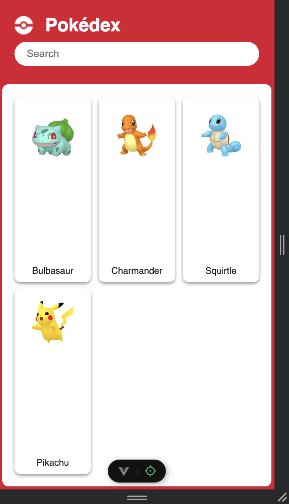 | 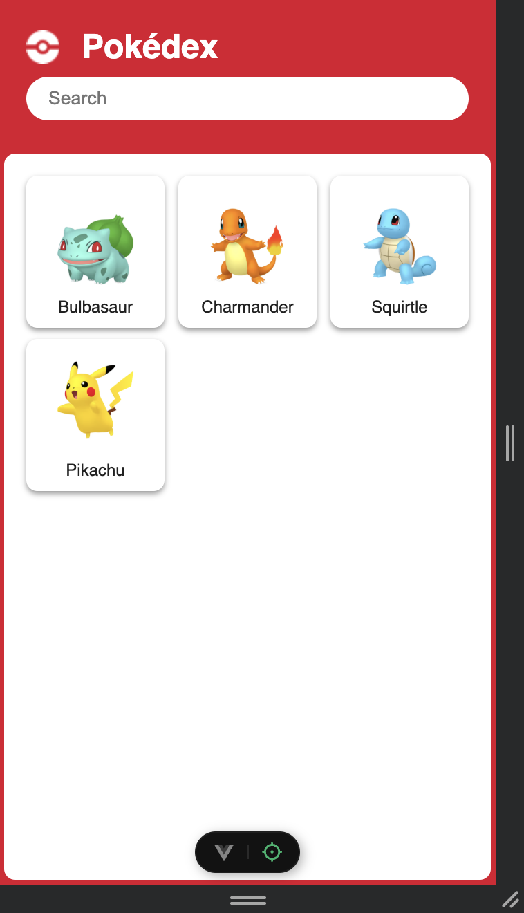 |

Om te zorgen dat de afbeeldingen altijd in de juist verhouding getoond worden, kan er met `height: auto` en `width: auto` gewerkt worden, met een `max-width` en `max-height` om de maximale grootte te bepalen. In het voorbeeld is er gekozen voor `max-width: 72px` en `max-height: 72px`.

| Met achtergrondkleur in onderste helft                                     | Zonder achtergrondkleur in onderste helft                                                |
| -------------------------------------------------------------------------- | ---------------------------------------------------------------------------------------- |
| 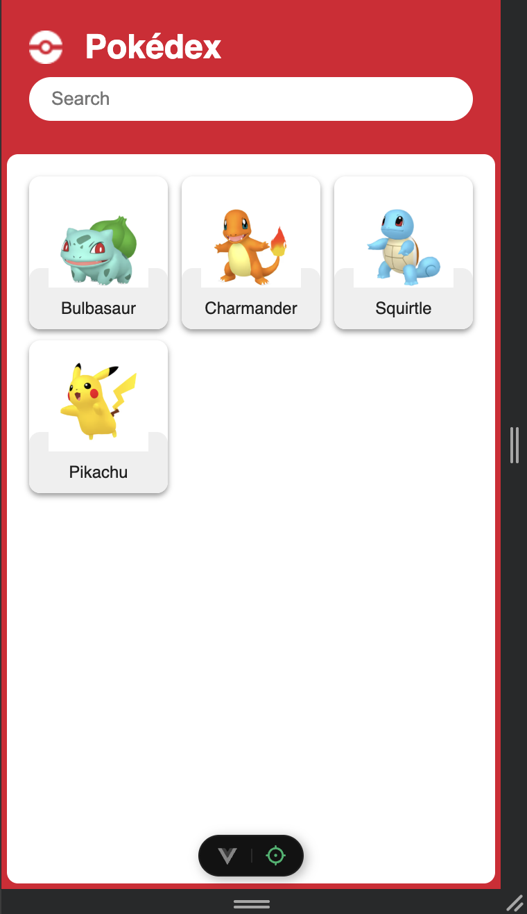 |  |

Doordat de afbeeldingen geen transparante achtergrond hebben, is de styling van het design niet na te bootsen. De achtergrond zal hierdoor weggelaten worden.

Elke Pokémon in de lijst moet een link bevatten naar zijn respectievelijke **DetailView**. Gebruik hiervoor de `<router-link>` component van Vue Router in combinatie met de `to`-property om naar de juiste route te linken. Doe dit via de `name`-property van de route, zodat er later makkelijk wijzigingen kunnen worden doorgevoerd in de URL-structuur indien nodig zonder dat alle links aangepast moeten worden.

bv.

- Bulbasaur linkt naar `/pokemon/bulbasaur`
- Charmander linkt naar `/pokemon/charmander`
- Squirtle linkt naar `/pokemon/squirtle`

De url-structuur voor de detailpagina's is `/pokemon/:id`, waarbij `:id` de naam van de Pokémon is.

<details>

  <summary>Hint - router-link gebruiken</summary>

Zonder name-based routing:

```html
<router-link :to="`/pokemon/${pokemon.name}`">
  <!-- inhoud van het item -->
</router-link>
```

Met name-based routing:

```html
<router-link :to="{ name: 'DetailView', params: { id: 'bulbasaur' } }">
  <!-- inhoud van het item -->
</router-link>
```

</details>

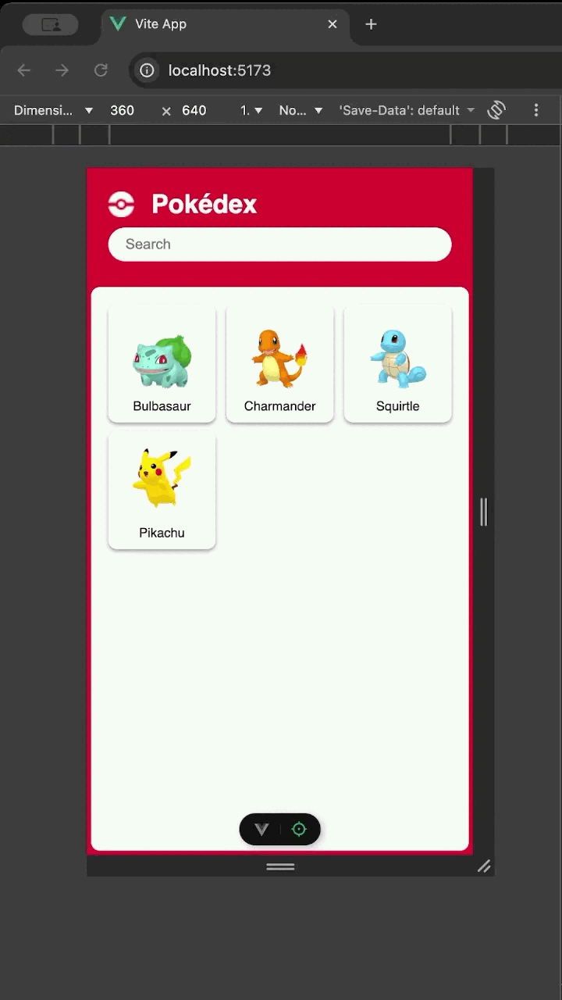

### DetailView

De **DetailView** toont gedetailleerde informatie over één specifieke Pokémon.

Om te starten zal de pagina hard-coded informatie tonen voor Bulbasaur.

bv.

- `/pokemon/bulbasaur` - toont informatie over Bulbasaur
- `/pokemon/charmander` - toont informatie over Bulbasaur
- ...

Nadat de pagina de details van één Pokémon toont, zal worden overgeschakeld naar het ophalen van de juiste gegevens op basis van de `id`-parameter in de URL.

Style de **DetailView** volgens het design in Figma.

Plaats de afbeelding als achtergrond via CSS. Door gebruik te maken van `background-repeat: no-repeat;` en `background-position: right 1rem center;` kan de afbeelding juist gepositioneerd worden.

De hoogte van de header is 220px.

De structuur en styling lijkt erg op die van de ListView, de achtergrond is nu groen i.p.v. rood en de header is hoger en bevat een achtergrondafbeelding.

| ListView structuur                                                   | DetailView structuur                                                       |
| -------------------------------------------------------------------- | -------------------------------------------------------------------------- |
|  | 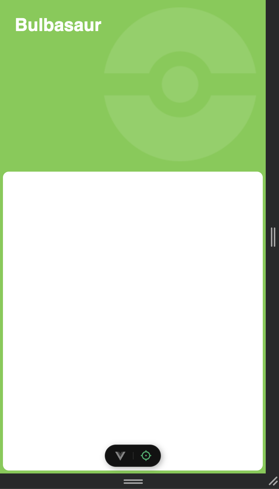 |

De afbeelding wordt in de header geplaatst en via `z-index` boven het witte vlak geplaatst. Hier valt op dat de gebruikte afbeelding geen transparante achtergrond heeft, voor de detailpagina zal een andere bron gebruikt worden voor de afbeeldingen.

De afbeelding heeft een maximale hoogte en maximale breedte van 225px.

Voor Bulbasaur is de afbeelding te vinden op: `https://www.pokemon.com/static-assets/content-assets/cms2/img/pokedex/full/001.png`.

| Zonder transparantie                                                                           |                                                                                              | Met transparantie |
| ---------------------------------------------------------------------------------------------- | -------------------------------------------------------------------------------------------- | ----------------- |
| 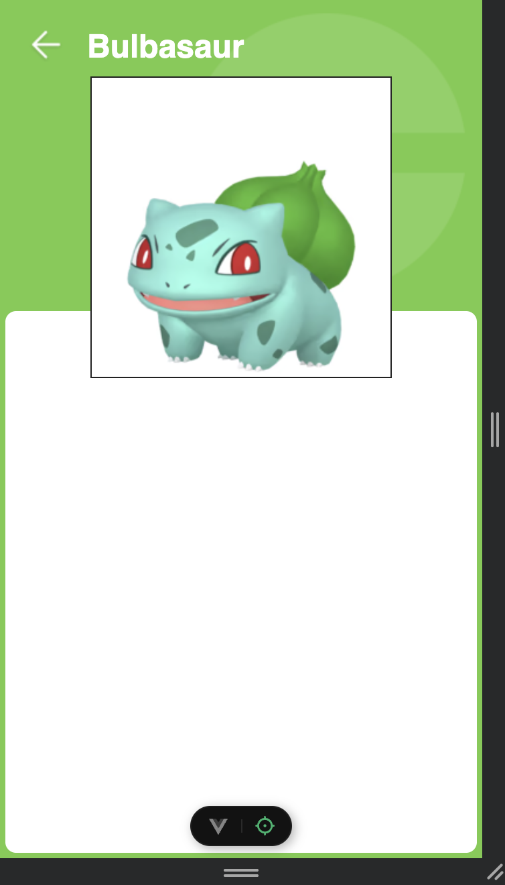 | 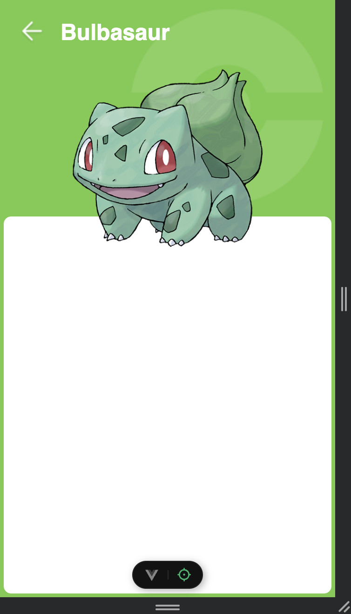 |

Bij het identificeren van mogelijke opdelingen van de detailpagina, vallen er drie duidelijke secties op: section met de types, section met de "about"-informatie en een section met de "Base Stats"-informatie.

Voeg deze onderdelen al toe aan de pagina, met tijdelijke randen om de verschillende sections te visualiseren. De drie sections onder elkaar kunnen gezien worden als children van een flex container met `flex-direction: column`, met een `gap` tussen de verschillende sections.

| Design                                                                            | Implementatie                                                                               |
| --------------------------------------------------------------------------------- | ------------------------------------------------------------------------------------------- |
| 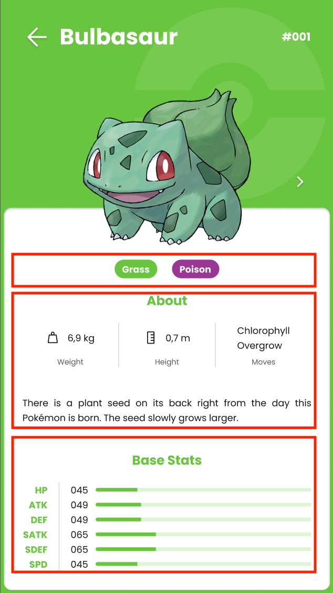 | 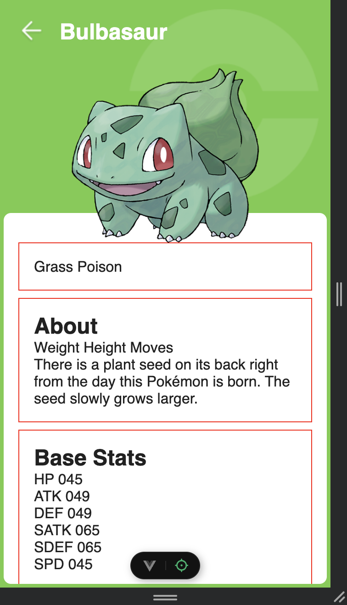 |

Merk op dat het witte gebied nog altijd scrollbaar is, bij het tijdelijke toevoegen van meer inhoud is dit goed te zien.


Per section kan er opnieuw gekeken worden naar de opdeling van de inhoud.

De "About"-section kan opnieuw opgedeeld worden in drie duidelijke subsections: de section met de titel, de section met de informatie over "height", "weight" en "moves" en de section met de beschrijving. Deze staan opnieuw onder elkaar, wat betekent dat de "About"-section met de rode border ook een flex container is met `flex-direction: column` en een `gap` tussen de verschillende subsections.

De "Base Stats"-section kan opgedeeld worden in twee duidelijke subsections: de section met de titel en de section met de verschillende stats. Deze staan opnieuw onder elkaar, wat betekent dat de "Base Stats"-section met de rode border ook een flex container is met `flex-direction: column` en een `gap` tussen de verschillende subsections.

| Design                                                                              | Implementatie                                                                                 |
| ----------------------------------------------------------------------------------- | --------------------------------------------------------------------------------------------- |
| 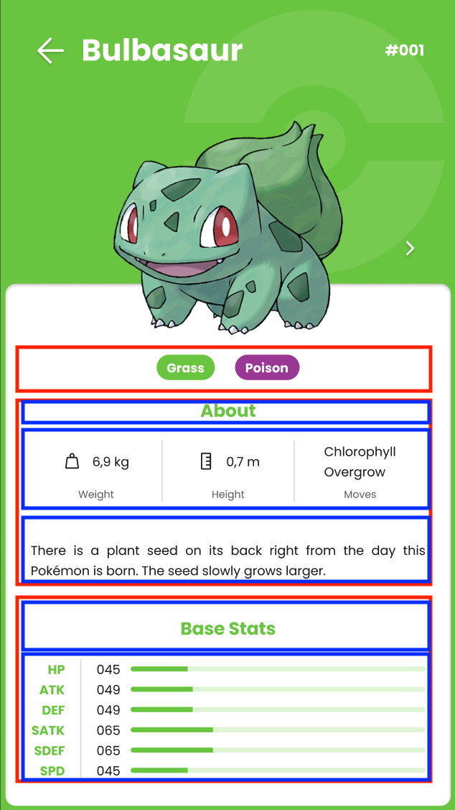 | 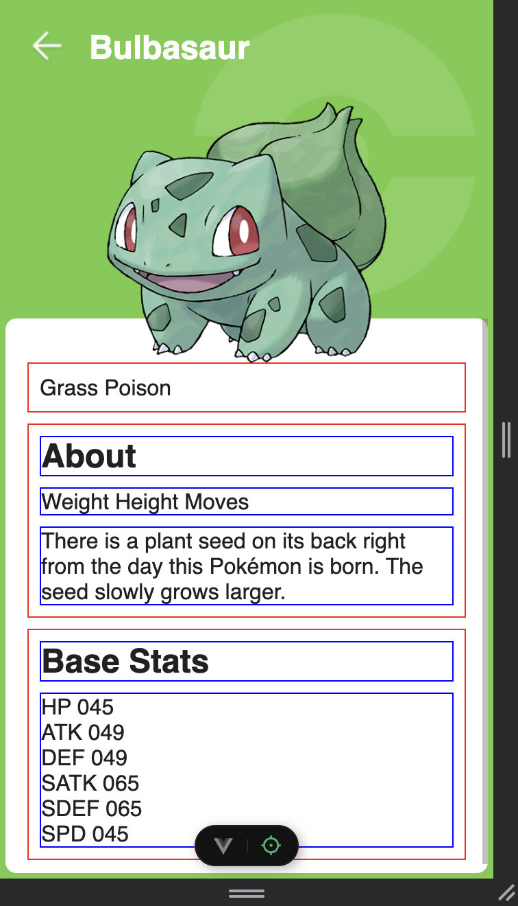 |

Vervolgens kan er per subsection opnieuw gekeken worden naar de opdeling van de inhoud.

In de "About"-section heet de subsection met de informatie over "height", "weight" en "moves" drie duidelijke items die naast elkaar staan. Dit kan gerealiseerd worden door deze subsection met de blauwe border als een flex container in te stellen met `display: flex` (de default is `flex-direction: row`, dus ze staan automatisch naast elkaar). Er kan met `justify-content` gewerkt worden om de items op verschillende manieren te positioneren.

In de "Base Stats"-section bevat de subsection met de verschillende stats meerdere items die onder elkaar staan. Dit kan gerealiseerd worden door deze subsection met de blauwe border als een flex container in te stellen met `display: flex` en `flex-direction: column`.

| Design                                                                              | Implementatie                                                                                 |
| ----------------------------------------------------------------------------------- | --------------------------------------------------------------------------------------------- |
| 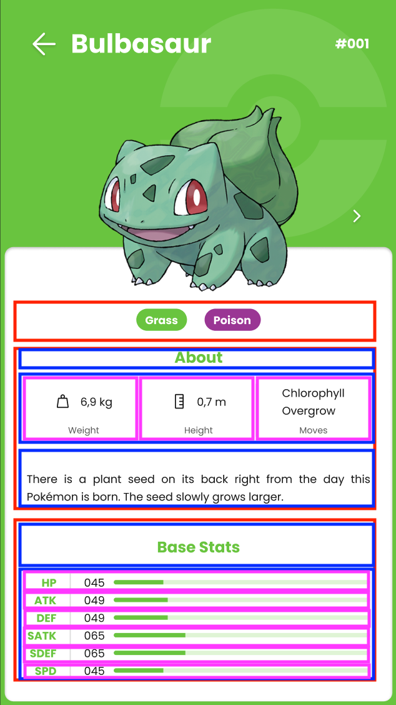 | 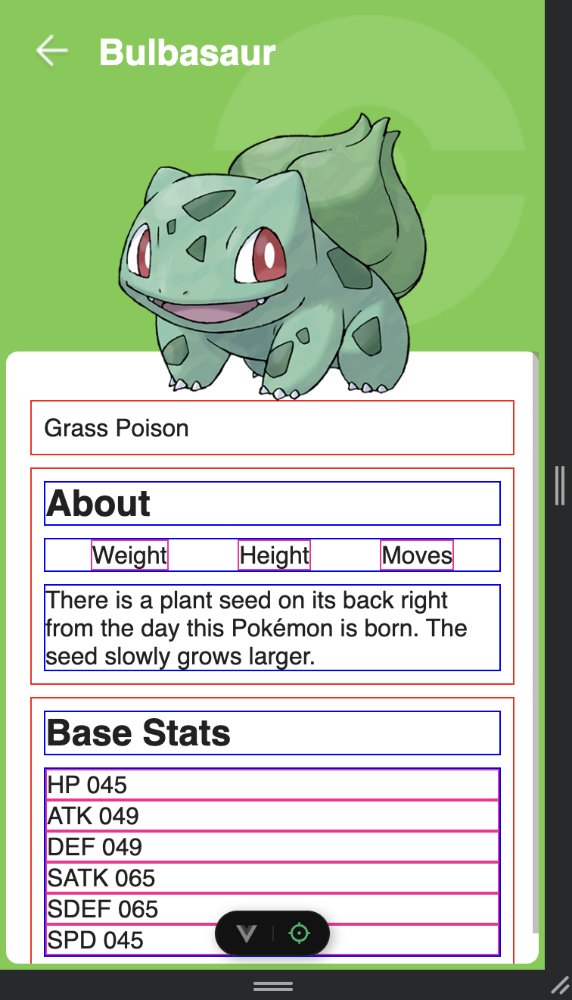 |

Door het design op voorhand te analyseren, kan er een duidelijke structuur geïdentificeerd worden die kan worden omgezet naar structuur in HTML om vervolgens via flexbox de juiste layout te realiseren. Per sectie en subsection kan het zijn dat er nog eens een extra container nodig is om de juiste layout te bekomen (bijvoorbeeld om de informatie van het gewicht en "weight" onder elkaar te plaatsen, ...).

Gebruik voor de types de kleuren uit de styleguide die als CSS Custom Properties zijn gedefinieerd op het `:root`-element in `main.css`. Bijvoorbeeld, voor het type "grass" kan er `background-color: var(--type-grass);` gebruikt worden om de juiste kleur toe te passen. Alles wat groen is, heeft de kleur van het type "grass".

De balken bij de "Base Stats" lijken misschien op `progress`-elementen, maar `progress`-elementen kunnen niet makkelijk gestyled worden. Gebruik onderstaande uitleg om zelf de balken te maken.

```html
<div class="detail-row">
  <span> HP </span>
  <span> 045 </span>
  <div class="progress">
    <div class="progress-bar" style="width: 45%"></div>
  </div>
</div>
```

```css
.detail-row {
  display: flex;
  align-items: center;
  gap: 0.5rem;
}

.detail-row span:first-child {
  width: 5rem;
}
.detail-row span:nth-child(2) {
  width: 3rem;
}
.detail-row span:first-child {
  text-align: right;
}

.progress {
  width: 100%;
  height: 0.5rem;
  background-color: color-mix(in srgb, var(--type-grass) 30%, white);
  border-radius: 1rem;
  overflow: hidden;
}

.progress-bar {
  height: 100%;
  background-color: var(--type-grass);
}
```

Merk op dat er hier enkele CSS-technieken gebruikt worden:

- Een `style`-attribuut met `width: 45%` op de `progress-bar` om de breedte van de balk aan te passen op basis van de stat-waarde. Dit gaat in tegen het advies om geen inline-styling te gebruiken, in dit geval is het uitzonderlijk toegestaan om dit later makkelijk dynamisch aan te kunnen passen met Vue (via `:style`-binding).
- `color-mix()`, dit is een nieuwe CSS-functie (om ondersteuning te controleren kan er gebruik gemaaktw worden van [caniuse](https://caniuse.com/?search=color-mix)). Dit maakt het mogelijk om twee kleuren te mengen. In dit geval wordt de kleur van het type gemengd met wit om een lichtere achtergrondkleur te bekomen voor de progress-balk.

| Design                                                                              | Implementatie                                                                                 |
| ----------------------------------------------------------------------------------- | --------------------------------------------------------------------------------------------- |
|  | 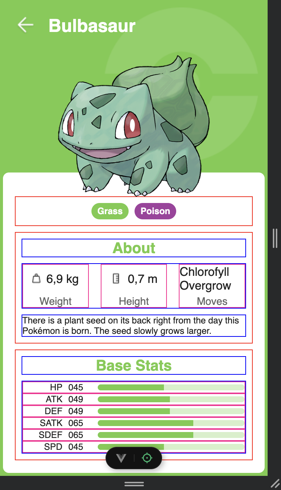 |

Nu de structuur en styling van de detailpagina is opgezet, kunnen de tijdelijke randen verwijderd worden. Mogelijks moet er wat extra finetuning gebeuren van de witruimtes.

Koppel tenslotte het pijltje linksboven in de header aan de Vue Router om terug te navigeren naar de overzichtspagina. Kies zelf of dit via `router-link` of via de `useRouter` composable zal gebeuren.

| Eindresultaat                                                        | Navigatie terug naar overzichtspagina                                          |
| -------------------------------------------------------------------- | ------------------------------------------------------------------------------ |
| 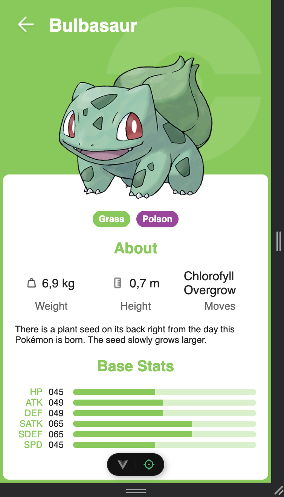 | 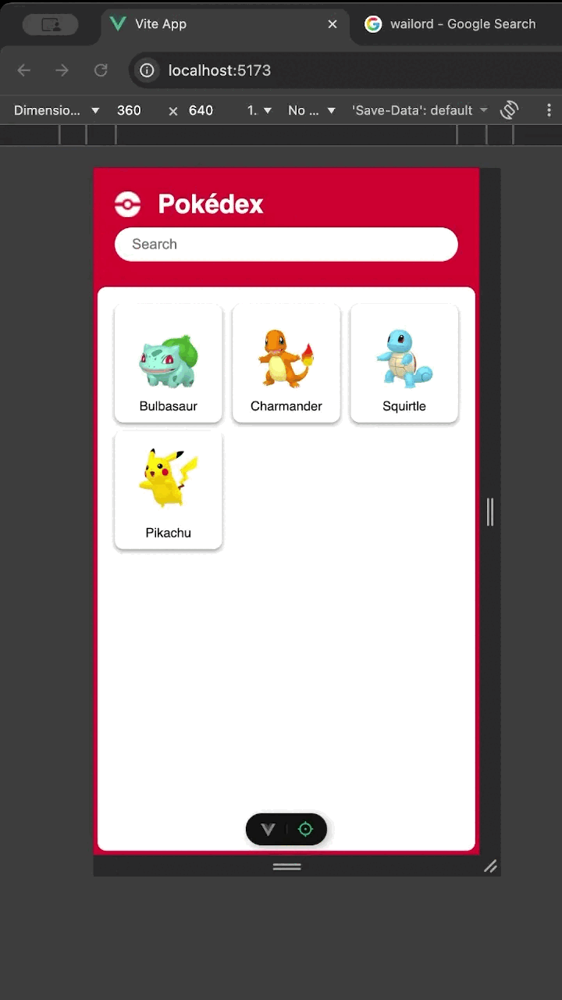 |

Voorlopig is dit voldoende. De detailpagina is nu gestyled volgens het design. Op dit moment is dit altijd de hard-coded informatie voor Bulbasaur. Later zal dit dynamisch worden gemaakt op basis van de URL-parameter waarmee de juiste gegevens worden opgehaald en weergegeven.

## Reactivity & Lifecycle (4 uur)

Momenteel is alle data hard-coded in de views. Er zal gebruik gemaakt worden van reactiviteit, lifecycle hooks, directives ... om de data dynamisch te maken. Binnen de ListView zal er een array van Pokémon-objecten worden gebruikt om de lijst te genereren met een `v-for`-directive. Binnen de DetailView zal diezelfde array van Pokémon-objecten worden gebruikt om het juiste object te filteren op basis van de `id`-parameter in de URL en de gegevens van die specifieke Pokémon weer te geven.

### ListView

De code kan er anders uitzien dan onderstaande code, dit is oké. Dit is een voorbeeld om te visualiseren hoe de data kan worden geïdentificeerd om de array van Pokémon-objecten te maken.

| Identificatie van herhaalde HTML                                                     | Identificatie van wat er verschilt per item                                                       |
| ------------------------------------------------------------------------------------ | ------------------------------------------------------------------------------------------------- |
| 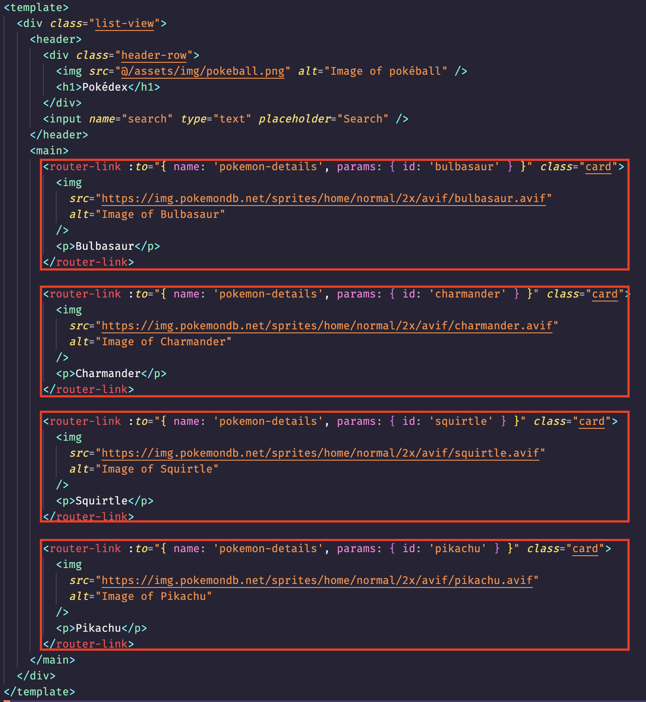 | 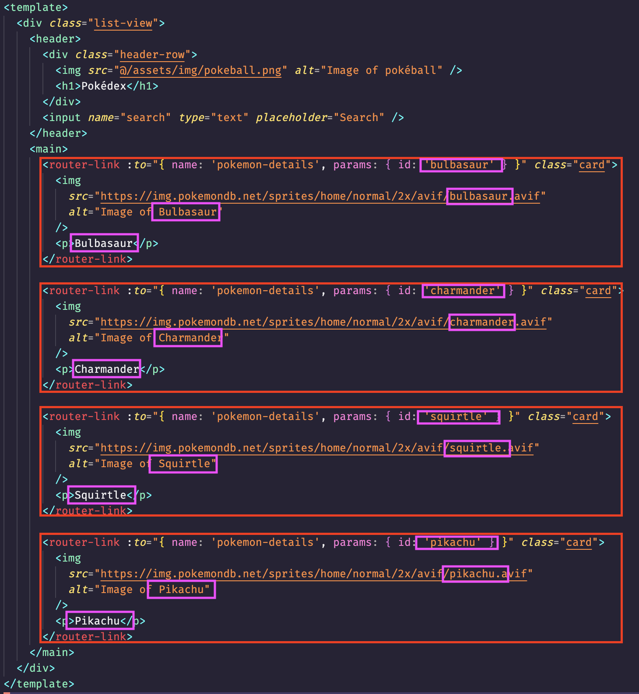 |

De data wordt uit de HTML gehaald en omgezet naar een array van objecten in de `script`-sectie van de ListView.

```js
const pokemonList = [
  { name: 'bulbasaur' },
  { name: 'charmander' },
  { name: 'squirtle' },
  { name: 'pikachu' },
];
```

De hard-coded HTML in de `template`-sectie wordt vervangen door één item dat herhaaldelijk wordt toegevoegd met de `v-for`-directive.

Denk eraan: wanneer data uit de `script`-sectie in de `template`-sectie wordt gebruikt, moet deze data `reactive` zijn. Indien dit niet het geval is, zal Vue wijzigingen aan de data niet detecteren en de DOM niet updaten. Gebruik de Vue Composable `ref` of `reactive` om de data `reactive` te maken.

Gebruik `attribute binding` (met `:`) om de `src`- en `alt`-attributen van de afbeelding een dynamische waarde te geven op basis van de naam.

```js
import { ref } from 'vue';

const pokemonList = ref([
  { name: 'bulbasaur' },
  { name: 'charmander' },
  { name: 'squirtle' },
  { name: 'pikachu' },
]);
```

<details>
  <summary>Oplossing v-for</summary>

```html
<script setup lang="ts">
  import { ref } from 'vue';

  const pokemonList = ref([
    { name: 'Bulbasaur' },
    { name: 'Charmander' },
    { name: 'Squirtle' },
    { name: 'Pikachu' },
  ]);
</script>

<template>
  <div class="list-view">
    <header>
      <div class="header-row">
        
        <h1>Pokédex</h1>
      </div>
      <input name="search" type="text" placeholder="Search" />
    </header>
    <main>
      <router-link
        v-for="pokemon in pokemonList"
        :key="pokemon.name"
        :to="{ name: 'pokemon-details', params: { id: pokemon.name.toLowerCase() } }"
        class="card"
      >
        
        <p>{{ pokemon.name }}</p>
      </router-link>
    </main>
  </div>
</template>
```

</details>

Momenteel wordt de naam doorgegeven in lowercase in de URL. Dit is niet ideaal, er zijn Pokémon met afwijkende namen (zoals `Mr. Mime`, `Nidoran♀`, ...). Om dit op te lossen zal een `id` worden toegevoegd aan het object waaraan het nummer van de pokémon wordt toegekend, dit nummer zal worden gebruikt in de URL in plaats van de naam. Deze data komt later uit de API, voorlopig kan dit hard-coded worden toegevoegd.

De nummers kunnen gevonden worden in deze [lijst](https://pokemondb.net/pokedex/national).

```js
const pokemonList = ref([
  { id: 1, name: 'Bulbasaur' },
  { id: 4, name: 'Charmander' },
  { id: 7, name: 'Squirtle' },
  { id: 25, name: 'Pikachu' },
]);
```

Refactor de `router-link` om de `id` te gebruiken in plaats van de naam.

<details>
  <summary>Oplossing router-link met id</summary>

```html
<router-link
  v-for="pokemon in pokemonList"
  :key="pokemon.id"
  :to="{ name: 'pokemon-details', params: { id: pokemon.id } }"
  class="card"
>
  <!-- ... -->
</router-link>
```

</details>

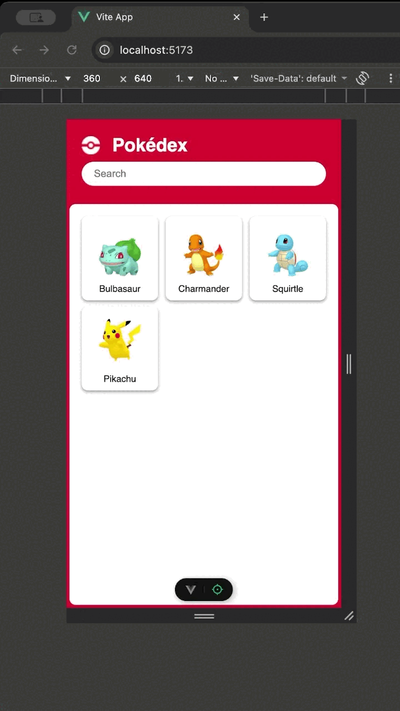

Doordat de items nu gerenderd worden met een `v-for`-directive, is het mogelijk om eenvoudig extra Pokémon toe te voegen aan de lijst door simpelweg een nieuw object toe te voegen aan de array in de `script`-sectie.

```js
const pokemonList = ref([
  { id: 1, name: 'Bulbasaur' },
  { id: 2, name: 'Ivysaur' },
  { id: 3, name: 'Venusaur' },
  { id: 4, name: 'Charmander' },
  { id: 5, name: 'Charmeleon' },
  { id: 6, name: 'Charizard' },
  { id: 7, name: 'Squirtle' },
  { id: 8, name: 'Wartortle' },
  { id: 9, name: 'Blastoise' },
  { id: 25, name: 'Pikachu' },
]);
```

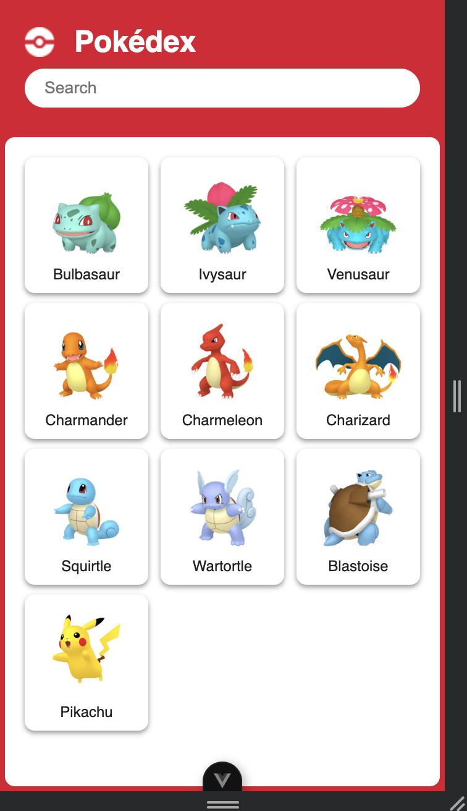

Tot de effectieve data-integratie met de API gebeurd, zal er gewerkt worden met de 4 hard-coded Pokémon in de lijst.

### DetailView

Momenteel is de detailpagina nog steeds hard-coded voor Bulbasaur. Dit zal worden aangepast zodat de juiste gegevens getoond worden op basis van de `id`-parameter in de URL.

Neem de array van Pokémon-objecten over uit de ListView (copy paste) naar de DetailView. Deze pagina heeft meer informatie nodig per Pokémon, voeg deze informatie toe aan elk object in de array.

| Unieke informatie per Pokémon                                                                  | Unieke informatie per Pokémon (vervolg)                                                           | De data per Pokémon in een object                                                           |
| ---------------------------------------------------------------------------------------------- | ------------------------------------------------------------------------------------------------- | ------------------------------------------------------------------------------------------- |
| 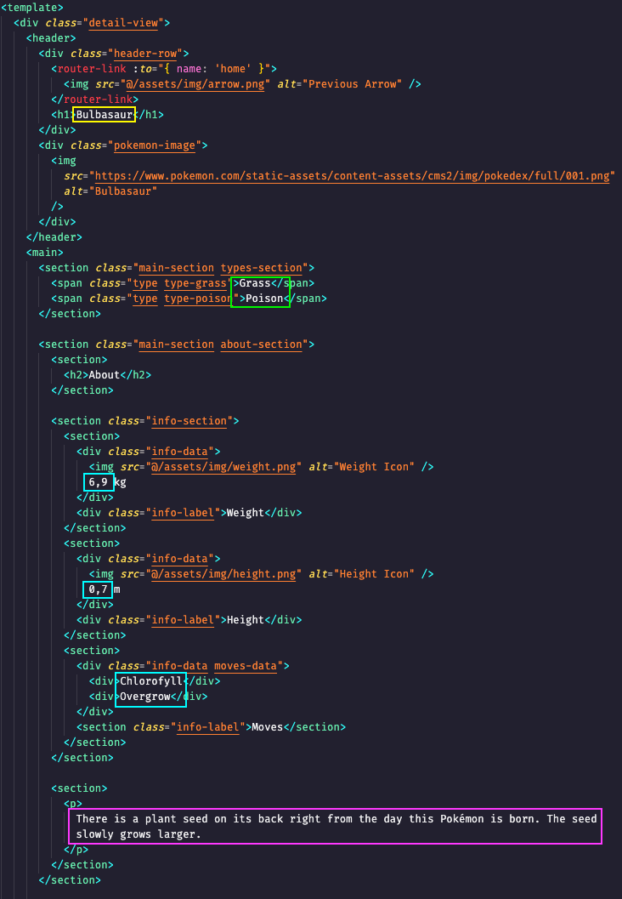 | 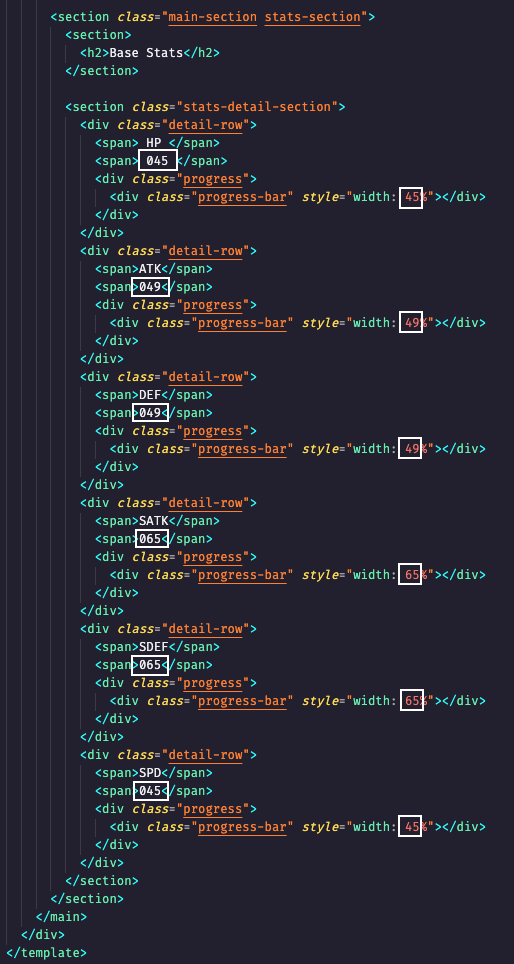 | 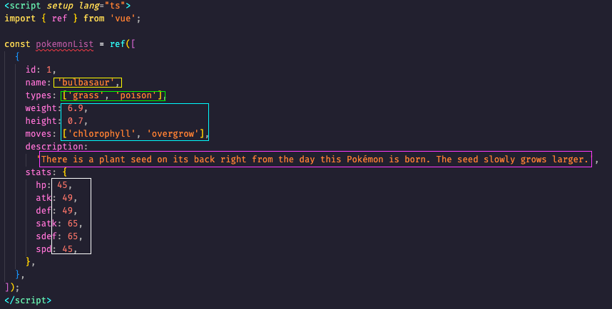 |

Voeg alle informatie van de vier Pokémon toe aan de array van objecten.

<details>
  <summary>Volledige data om te copy pasten</summary>

```js
const pokemonList = ref([
  {
    id: 1,
    name: 'bulbasaur',
    types: ['grass', 'poison'],
    weight: 6.9,
    height: 0.7,
    moves: ['Chlorophyll', 'Overgrow'],
    description:
      'There is a plant seed on its back right from the day this Pokémon is born. The seed slowly grows larger.',
    stats: {
      hp: 45,
      atk: 49,
      def: 49,
      satk: 65,
      sdef: 65,
      spd: 45,
    },
  },
  {
    id: 4,
    name: 'charmander',
    types: ['fire'],
    weight: 8.5,
    height: 0.6,
    moves: ['Mega-Punch', 'Fire-Punch'],
    description:
      'It has a preference for hot things. When it rains, steam is said to spout from the tip of its tail.',
    stats: {
      hp: 39,
      atk: 52,
      def: 43,
      satk: 60,
      sdef: 50,
      spd: 65,
    },
  },
  {
    id: 7,
    name: 'squirtle',
    types: ['water'],
    weight: 9.0,
    height: 0.5,
    moves: ['Torrent', 'Rain-Dish'],
    description:
      'When it retracts its long neck into its shell, it squirts out water with vigorous force.',
    stats: {
      hp: 44,
      atk: 48,
      def: 65,
      satk: 50,
      sdef: 64,
      spd: 43,
    },
  },
  {
    id: 25,
    name: 'pikachu',
    types: ['electric'],
    weight: 6.0,
    height: 0.4,
    moves: ['Mega-Punch', 'Pay-Day'],
    description:
      'Pikachu that can generate powerful electricity have cheek sacs that are extra soft and super stretchy.',
    stats: {
      hp: 35,
      atk: 55,
      def: 40,
      satk: 50,
      sdef: 50,
      spd: 90,
    },
  },
]);
```

</details>

Om de `id`-parameter uit de URL te halen, kan er gebruik gemaakt worden van de `useRoute` composable van Vue Router. Deze composable geeft toegang tot de huidige route en de parameters ervan.

```js
import { useRoute } from 'vue-router';

const route = useRoute();

onMounted(() => {
  console.log(route.params.id); // toont de id-parameter uit de URL
});
```

Voorzie een `ref` om de Pokémon die getoond moet worden op te slaan. Gebruik de `onMounted` lifecycle hook om de `id`-parameter uit de URL te halen, de juiste Pokémon te zoeken in de array van objecten en ken het resultaat toe aan de `ref`-variabele.

> Tip: Gebruik de [`find`-methode](https://developer.mozilla.org/en-US/docs/Web/JavaScript/Reference/Global_Objects/Array/find) van arrays om het juiste object te zoeken op basis van de `id`.

<details>
  <summary>Oplossing - Pokémon zoeken op basis van id uit de URL</summary>

```js
import { ref, onMounted } from 'vue';
import { useRoute } from 'vue-router';

const route = useRoute();
const selectedPokemon = ref(null);

onMounted(() => {
  const pokemonId = parseInt(route.params.id, 10);
  selectedPokemon.value = pokemonList.value.find((pokemon) => pokemon.id === pokemonId);
});
```

</details>

Gebruik de `selectedPokemon`-variabele om de gegevens van de Pokémon weer te geven in de `template`-sectie van de DetailView. Vergeet niet om een `v-if`-directive toe te voegen om te controleren of `selectedPokemon` een waarde heeft. Alle waarden die aangeduid zijn in de screenshots moeten nu dynamisch worden weergegeven op basis van de geselecteerde Pokémon.

bv.

- Tekst

  ```html
  <h1>Bulbasaur</h1>
  ```

  Zal worden:

  ```html
  <h1>{{ selectedPokemon.name }}</h1>
  ```

- Gedeeltelijke tekst

  ```html
  <div class="info-data">
    
    6,9 kg
  </div>
  ```

  Zal worden:

  ```html
  <div class="info-data">
    
    {{ selectedPokemon.weight }} kg
  </div>
  ```

- Attribuut

  ```html
  <h2>About</h2>
  ```

  Zal worden:

  ```html
  <h2 :style="{ color: `var(--type-${selectedPokemon.types[0]})` }">About</h2>
  ```

Er moet rekening mee worden gehouden dat sommige attributen in de template via `attribute binding` moeten worden gekoppeld om dynamische waarden te tonen. Enkele attributen om rekening mee te houden:

- De `src`- en `alt`-attributen van de afbeelding in de header.
- De `background-color` van de type-badges, dit kan via een `:class` of `:style`-binding.
- De `style`-binding van de `progress-bar` om de breedte van de balk aan te passen op basis van de stat-waarde.

Er zijn onderdelen die meerdere keren voorkomen, bijvoorbeeld de types en de verschillende stats. Gebruik hiervoor een `v-for`-directive om deze HTML-elementen dynamisch te genereren op basis van de data in het `selectedPokemon`-object.

Enkele hints indien nodig:

<details>
  <summary>Utility-functies om data te formatteren</summary>

**Nummers formatteren met nullen vooraan**

Zowel het nummer in de URL als de nummers van de "Base Stats" moeten altijd uit minstens drie cijfers bestaan. Indien het nummer uit minder dan drie cijfers bestaat, moeten er nullen vooraan toegevoegd worden.

```js
function formatNumber(number, length = 3) {
  return number.toString().padStart(length, '0');
}
```

De tweede parameter `length` is optioneel en standaard ingesteld op 3. Op deze manier is de functie herbruikbaar voor andere lengtes indien nodig.

**String met hoofdletter aan het begin**

Dit kan via JavaScript:

```js
function capitalizeFirstLetter(word) {
  return word.charAt(0).toUpperCase() + word.slice(1);
}
```

Maar, dit kan ook via CSS, geef de voorkeur aan `text-transform: capitalize;` in de CSS om dit te realiseren.

</details>

<details>
  <summary>Types weergeven met de juiste kleuren</summary>

Gebruik een `v-for`-directive om de types van de Pokémon weer te geven. Voor elke type kan er een `span`-element worden gebruikt met een dynamische `background-color` die de juiste kleur uit de CSS Custom Properties haalt.

```html
<span v-for="type in selectedPokemon.types" :key="type" class="type-badge" :class="`type-${type}`">
  {{ type }}
</span>
```

Hier wordt zowel een `:class`-binding als een vaste class `type-badge` gebruikt. De vaste class kan gebruikt worden voor algemene styling van de badges, terwijl de dynamische class `type-{type}` gebruikt kan worden om de specifieke achtergrondkleur toe te passen.

Voeg ook de volgende CSS toe om de achtergrondkleuren te koppelen aan de juiste types:

```css
.type-grass {
  background-color: var(--type-grass);
  color: var(--color-grayscale-white);
}

.type-poison {
  background-color: var(--type-poison);
  color: var(--color-grayscale-white);
}

.type-fire {
  background-color: var(--type-fire);
  color: var(--color-grayscale-white);
}

.type-water {
  background-color: var(--type-water);
  color: var(--color-grayscale-white);
}

.type-electric {
  background-color: var(--type-electric);
  color: var(--color-grayscale-white);
}
```

Later zullen er meer types worden toegevoegd, voor nu is dit voldoende.

</details>

<details>
  <summary>Base Stats weergeven met progress bars</summary>

Gebruik een `v-for`-directive om de verschillende stats van de Pokémon weer te geven. Voor elke stat kan er een `detail-row`-element worden gebruikt met een `progress-bar` waarvan de breedte dynamisch wordt aangepast op basis van de stat-waarde.

```html
<section class="main-section stats-section">
  <section>
    <h2>Base Stats</h2>
  </section>

  <section class="stats-detail-section">
    <div class="detail-row" v-for="(value, stat) in selectedPokemon.stats" :key="stat">
      <span>{{ stat.toUpperCase() }}</span>
      <!-- Dit gaat ervanuit dat er een formatNumber-functie is om het nummer te formatteren -->
      <span>{{ formatNumber(value) }}</span>
      <div class="progress">
        <div class="progress-bar" :style="{ width: `${value}%` }"></div>
      </div>
    </div>
  </section>
</section>
```

Momenteel gaat de progress-bar ervan uit dat de maximale waarde 100 is. In de realiteit is de maximale waarde voor een stat `255`. Om de breedte van de balk correct weer te geven moet de waarde dus omgerekend worden naar een percentage van 255.

```html
<div class="progress-bar" :style="{ width: `${(value / 255) * 100}%` }"></div>
```

De stat-namen en de progress-bar krijgen ook de juiste kleur op basis van het type van de Pokémon. Het is oké om hiervoor `style`-binding te gebruiken.

```html
<span :style="{ color: `var(--type-${selectedPokemon.types[0]})` }">
  {{ stat.toUpperCase() }}
</span>
```

```html
<div
  class="progress"
  :style="{ backgroundColor: `color-mix(in srgb, var(--type-${selectedPokemon.types[0]}) 30%, white)` }"
>
  <div
    class="progress-bar"
    :style="{
    width: `${(value / 255) * 100}%`,
    backgroundColor: `var(--type-${selectedPokemon.types[0]})`,
  }"
  ></div>
</div>
```

</details>

<details>
  <summary>Gekleurde achtergrond</summary>

```html
<div
  v-if="selectedPokemon"
  class="detail-view"
  :style="{ backgroundColor: `var(--type-${selectedPokemon.types[0]})` }"
>
  <!-- rest van de template -->
</div>
```

</details>

Voorzie logica die ervoor zorgt dat wanneer er geen match is voor de `id`-parameter in de URL, er een melding wordt weergegeven dat de Pokémon niet gevonden is. Dit kan bijvoorbeeld met een `v-else`-directive of een `v-if`-directive met de omgekeerde voorwaarde.

Gebruik de `useRouter()`-composable om een knop te voorzien die terug navigeert naar de overzichtspagina via `router.push()` via de `name` van de route.

<details>
  <summary>Hint - `Pokémon not found`-melding</summary>

```js
import { useRouter } from 'vue-router';

const router = useRouter();
```

```html
<template>
  <div v-if="selectedPokemon" class="detail-view">
    <!-- detail view content -->
  </div>
  <div v-else class="not-found">
    <h2>Pokémon not found</h2>
    <p>No information available for the requested Pokémon.</p>
    <button @click="router.push({ name: 'home' })">Home</button>
  </div>
</template>
```

```css
.not-found {
  padding: 2rem;
  height: 100vh;
  display: flex;
  flex-direction: column;
  justify-content: center;
  align-items: center;
  gap: 1rem;
  background-color: var(--color-grayscale-white);
  color: var(--color-grayscale-dark);
  text-align: center;
}

button {
  padding: 0.5rem 1rem;
  border: none;
  border-radius: 4px;
  cursor: pointer;
  background-color: var(--color-grayscale-light);
}
```

</details>

Nu er een functie is die ons het nummer kan formatteren met nullen vooraan, kan deze ook gebruikt worden om het nummer rechtsboven in de header weer te geven.

Door het nummer toe te voegen zal de HTML-structuur wijzigen om het stylen via flexbox mogelijk te maken.

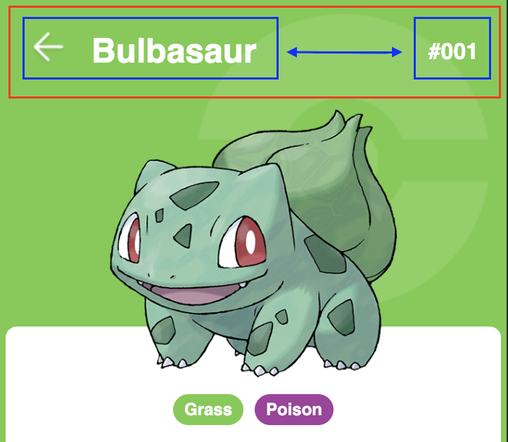

De rode kader geeft de `header-row` aan, er wordt een nieuw container-element toegevoegd rondom de pijl en de naam van de Pokémon - deze krijgt de class `header-row-item` en zal via flexbox opnieuw naast elkaar worden geplaatst en verticaal gecentreerd worden. De rode kader plaatst vervolgens de `header-row-item`- en `header-pokemon-number`-elementen zo ver als mogelijk uit elkaar.

<details>
  <summary>Oplossing - Header met nummer</summary>

```html
<div class="header-row">
  <div class="header-row-item">
    <router-link :to="{ name: 'home' }">
      
    </router-link>
    <h1>{{ selectedPokemon.name }}</h1>
  </div>

  <span class="header-pokemon-number"> #{{ formatNumber(selectedPokemon.id) }} </span>
</div>
```

```css
.header-row {
  display: flex;
  align-items: center;
  gap: 1rem;
  margin-bottom: 0.5rem;

  justify-content: space-between;
}

.header-row-item {
  display: flex;
  gap: 1rem;
  align-items: center;
}

.header-pokemon-number {
  font-size: 1;
}
```

</details>

Na het voltooien van deze stappen zal de DetailView dynamisch de juiste gegevens weergeven op basis van de `id`-parameter in de URL.

Demo van de dynamische DetailView:

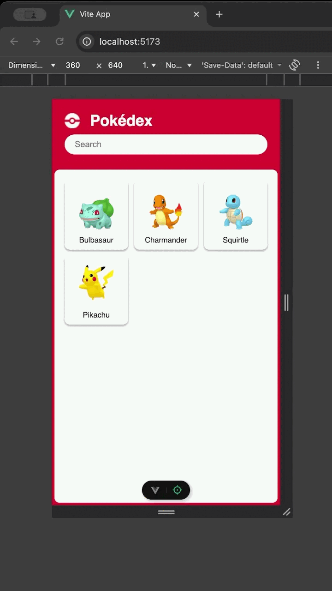

## Components (8 uur)

Voorzie een map genaamd `components` in de `src`-map van het project, hierin zullen herbruikbare Vue-componenten worden geplaatst. In dit hoofdstuk zal er niks wijzigen aan de functionaliteit van de applicatie, er zal niks wijzigen aan de styling van de applicatie. De code zal enkel opgesplitst worden in herbruikbare componenten om de leesbaarheid en onderhoudbaarheid te verbeteren.

### ListView

Bij het bekijken van de ListView valt op dat elk item in de lijst dezelfde structuur en styling heeft. Dit is een goede indicator dat het item kan worden omgezet naar een herbruikbaar component.

| Identificatie van herhaalde structuur in de ListView                                        | Identificatie van de code voor deze structuur                                     |
| ------------------------------------------------------------------------------------------- | --------------------------------------------------------------------------------- |
|  | 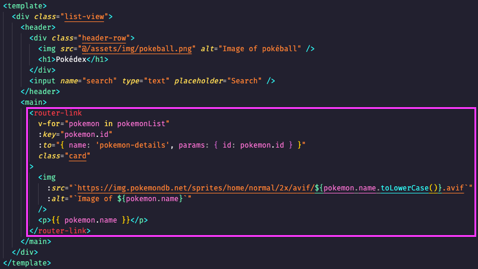 |

Bij het identificeren van de code die hoort bij het item, moet er gekeken worden naar de `script`-, `template`- en `style`-secties van de ListView. Alles wat hoort bij het item, moet worden overgebracht naar een nieuw component.

| template                                                                                               | style                                                                                            |
| ------------------------------------------------------------------------------------------------------ | ------------------------------------------------------------------------------------------------ |
| 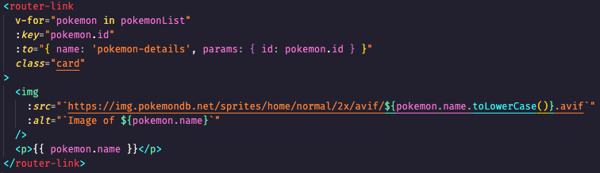 | 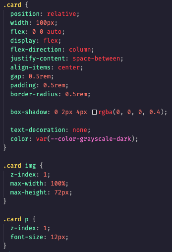 |

Deze structuur wordt via de `v-for`-directive herhaaldelijk toegevoegd in de ListView. Één item is dus de structuur zonder de `v-for`-directive.

Maak een nieuw component genaamd `PokemonListItem.vue` in de `components`-map. Verplaats de code die hoort bij het item naar dit nieuwe component.

Om de data van de Pokémon door te geven kan er op twee manieren gewerkt worden:

| defineProps met Object                                                                                    | defineProps met losse properties                                                                               |
| --------------------------------------------------------------------------------------------------------- | -------------------------------------------------------------------------------------------------------------- |
| 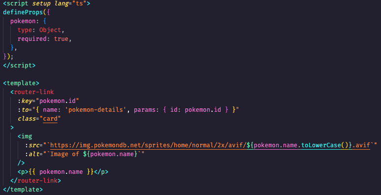 | 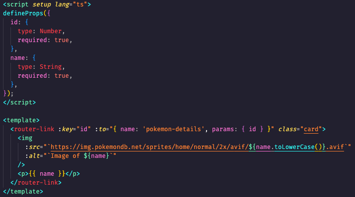 |

Beide manieren zijn correct, in dit geval zal er gekozen worden voor de tweede manier met losse properties. Hierdoor is het duidelijk welke properties er verwacht worden, wat het type van elke prop is en of de prop verplicht is of niet.

<details>
  <summary>Oplossing - PokemonListItem component</summary>

```html
<script setup lang="ts">
  defineProps({
    id: {
      type: Number,
      required: true,
    },
    name: {
      type: String,
      required: true,
    },
  });
</script>

<template>
  <router-link :key="id" :to="{ name: 'pokemon-details', params: { id } }" class="card">
    
    <p>{{ name }}</p>
  </router-link>
</template>

<style scoped>
  .card {
    position: relative;
    width: 100px;
    flex: 0 0 auto;
    display: flex;
    flex-direction: column;
    justify-content: space-between;
    align-items: center;
    gap: 0.5rem;
    padding: 0.5rem;
    border-radius: 0.5rem;

    box-shadow: 0 2px 4px rgba(0, 0, 0, 0.4);

    text-decoration: none;
    color: var(--color-grayscale-dark);
  }

  .card img {
    z-index: 1;
    max-width: 100%;
    max-height: 72px;
  }

  .card p {
    z-index: 1;
    font-size: 12px;
  }
</style>
```

</details>

Gebruik het nieuwe `PokemonListItem`-component in de ListView om elk item in de lijst weer te geven. Verwijder de code die is verplaatst naar het component en vervang deze door het component met de juiste props.

Importeren kan door gebruik te maken van de `@`-alias die verwijst naar de `src`-map van het project.

```js
import PokemonListItem from '@/components/PokemonListItem.vue';
```

Voor de wijziging:

```html
<router-link
  v-for="pokemon in pokemonList"
  :key="pokemon.id"
  :to="{ name: 'pokemon-details', params: { id: pokemon.id } }"
  class="card"
>
  
  <p>{{ pokemon.name }}</p>
</router-link>
```

Na de wijziging:

```html
<PokemonListItem
  v-for="pokemon in pokemonList"
  :key="pokemon.id"
  :id="pokemon.id"
  :name="pokemon.name"
/>
```

Vergeet niet om de CSS-regels die verplaatst zijn naar het component te verwijderen uit de ListView.

Functioneel doet de ListView hetzelfde als voorheen, maar de code is leesbaarder en onderhoudbaarder doordat er gebruik wordt gemaakt van een herbruikbaar component voor de items in de lijst.

Een ander onderdeel dat omgezet kan worden naar een component is de header van de ListView. Dit onderdeel wordt niet herhaaldelijk gebruikt, maar het is een duidelijk afgebakend onderdeel dat los staat van de rest van de pagina.

Verplaats de code van de header (template en style) naar een nieuwe component genaamd `PokemonListHeader.vue` in de `components`-map.

<details>
  <summary>Oplossing - PokemonListHeader component</summary>

De component kan er als volgt uitzien:

```html
<template>
  <header>
    <div class="header-row">
      
      <h1>Pokédex</h1>
    </div>
    <input name="search" type="text" placeholder="Search" />
  </header>
</template>

<style scoped>
  header {
    padding: 1rem;
    margin-bottom: 0.5rem;
    color: var(--color-grayscale-white);
  }

  header h1 {
    font-size: 1.5rem;
  }

  .header-row {
    display: flex;
    align-items: center;
    gap: 1rem;
    margin-bottom: 0.5rem;
  }

  input {
    width: 100%;
    padding: 0.5rem 1rem;
    border: none;
    border-radius: 2rem;
    color: var(--color-grayscale-medium);
  }
</style>
```

Deze wordt geïmporteerd en gebruikt in de ListView:

```html
<script setup lang="ts">
  import PokemonListHeader from '@/compontens/PokemonListHeader.vue';
  import PokemonListItem from '@/compontens/PokemonListItem.vue';
  import { ref } from 'vue';

  const pokemonList = ref([
    { id: 1, name: 'Bulbasaur' },
    { id: 4, name: 'Charmander' },
    { id: 7, name: 'Squirtle' },
    { id: 25, name: 'Pikachu' },
  ]);
</script>

<template>
  <div class="list-view">
    <PokemonListHeader />
    <main>
      <PokemonListItem
        v-for="pokemon in pokemonList"
        :key="pokemon.id"
        :id="pokemon.id"
        :name="pokemon.name"
      />
    </main>
  </div>
</template>

<style scoped>
  .list-view {
    height: 100vh;
    background-color: var(--color-primary);
    padding: 0.25rem;

    display: flex;
    flex-direction: column;
  }

  main {
    background-color: var(--color-grayscale-white);
    border-radius: 8px;
    padding: 1rem;
    flex-grow: 1;
    overflow-y: auto;

    display: flex;
    flex-wrap: wrap;
    justify-content: space-between;
    align-content: flex-start;
    gap: 0.5rem;
  }
</style>
```

</details>

Bij het bekijken van de code valt op dat de ListView nu bestaat uit een PokemonListHeader-component en een main-element dat de lijst met Pokémon-items bevat. Momenteel is de styling van de lijst nog steeds aanwezig in de ListView (op het `main`-element). Bij het opsplitsen in componenten is het belangrijk om na te denken over welke styling bij welk element hoort.

Het gedrag van het `main`-element (zoals het scrollen) hoort bij de ListView zelf en blijft dus in de CSS van de ListView. De styling die het gedrag van de lijst-items bepaalt (zoals de flexbox-layout) is niet essentieel voor het `main`-element. Deze styling zal verplaatst worden naar een `PokemonList.vue`-component die een lijst van Pokémon-items zal ontvangen als prop of via een slot (voor deze component zal er gekozen worden voor een `slot`).

Om dit duidelijk te maken zal eerst de CSS die hoort bij de lijst op een apart element worden geplaatst. Dit element zal vervolgens verplaatst worden naar een nieuw component.

| Voor wijziging                                                                       | Na wijziging                                                                              |
| ------------------------------------------------------------------------------------ | ----------------------------------------------------------------------------------------- |
| 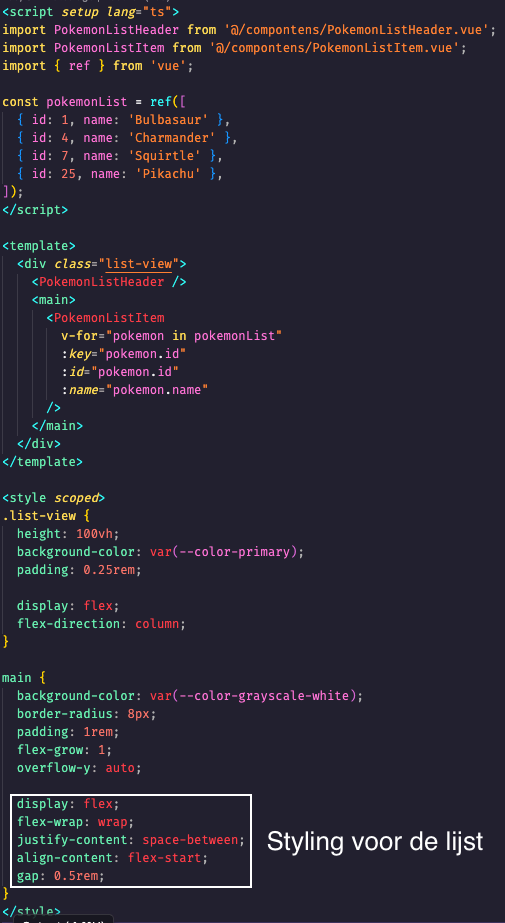 | 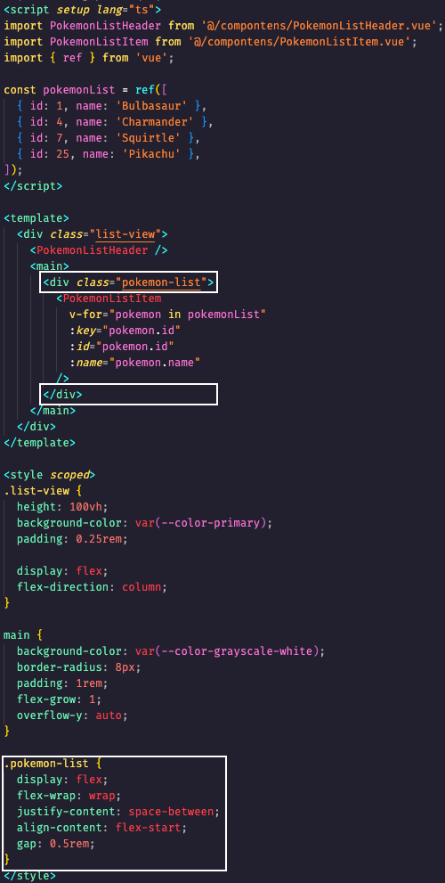 |

Dit gedeelte kan nu verplaatst worden naar een nieuw component genaamd `PokemonList.vue` in de `components`-map. Er wordt een `slot` voorzien om de lijst-items door te geven vanuit de ListView.

<details>
  <summary>Oplossing - PokemonList component</summary>

De component kan er als volgt uitzien:

```html
<template>
  <div class="pokemon-list">
    <slot></slot>
  </div>
</template>

<style scoped>
  .pokemon-list {
    display: flex;
    flex-wrap: wrap;
    justify-content: space-between;
    align-content: flex-start;
    gap: 0.5rem;
  }
</style>
```

Deze wordt geïmporteerd en gebruikt in de ListView:

```html
<script setup lang="ts">
  import PokemonList from '@/compontens/PokemonList.vue';
  import PokemonListHeader from '@/compontens/PokemonListHeader.vue';
  import PokemonListItem from '@/compontens/PokemonListItem.vue';
  import { ref } from 'vue';

  const pokemonList = ref([
    { id: 1, name: 'Bulbasaur' },
    { id: 4, name: 'Charmander' },
    { id: 7, name: 'Squirtle' },
    { id: 25, name: 'Pikachu' },
  ]);
</script>

<template>
  <div class="list-view">
    <PokemonListHeader />
    <main>
      <PokemonList>
        <PokemonListItem
          v-for="pokemon in pokemonList"
          :key="pokemon.id"
          :id="pokemon.id"
          :name="pokemon.name"
        />
      </PokemonList>
    </main>
  </div>
</template>

<style scoped>
  .list-view {
    height: 100vh;
    background-color: var(--color-primary);
    padding: 0.25rem;

    display: flex;
    flex-direction: column;
  }

  main {
    background-color: var(--color-grayscale-white);
    border-radius: 8px;
    padding: 1rem;
    flex-grow: 1;
    overflow-y: auto;
  }
</style>
```

</details>

De ListView is nu opgesplitst in drie herbruikbare componenten:

- `PokemonListHeader.vue` - dit bevat enkel een template en styling voor de header.
- `PokemonListItem.vue` - dit bevat de template, styling en props om één item in de lijst weer te geven.
- `PokemonList.vue` - dit bevat de styling voor de lijst zelf en een slot waar de lijstitems in geplaatst kunnen worden.

Dit zorgt ervoor dat de ListView enkel nog styling bevat die nodig is voor de pagina zelf, al de rest is opgesplitst in herbruikbare componenten die ook in andere delen van de applicatie gebruikt kunnen worden indien nodig. Zelfs wanneer het niet op meerdere plaatsen wordt gebruikt, zorgt het opsplitsen in componenten voor een betere leesbaarheid en onderhoudbaarheid van de code.

### DetailView

De DetailView kan op een gelijkaardige manier opgesplitst worden in herbruikbare componenten. Enkele onderdelen die hiervoor in aanmerking komen:

- Header
- Type badges
- Info items (weight, height, moves)
- Stat row
- Info sections (About, Base Stats)

| Section components                                                                                        | Components                                                                                |
| --------------------------------------------------------------------------------------------------------- | ----------------------------------------------------------------------------------------- |
| 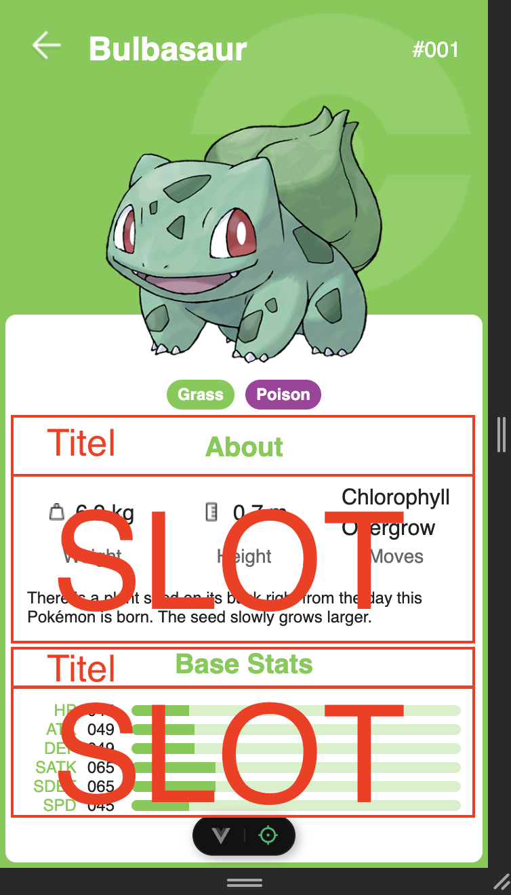 | 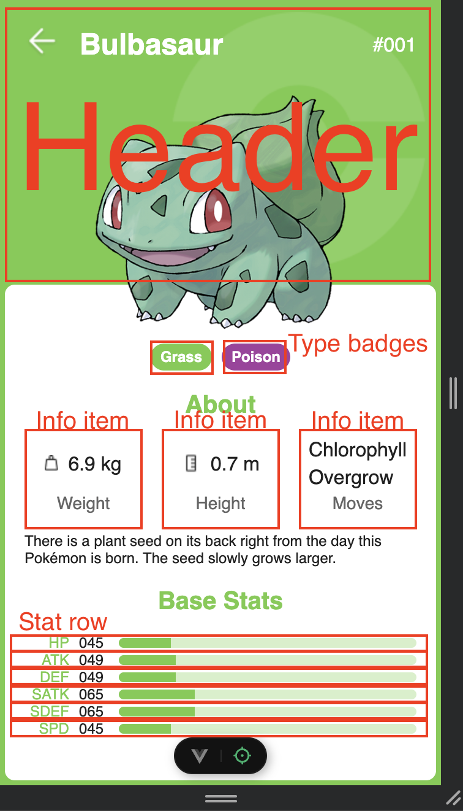 |

#### Header

Er zal eerst een component worden gemaakt van de header. Maak een nieuw component genaamd `PokemonDetailHeader.vue` in de `components`-map. Verplaats de code van de header (script, template en style) naar dit nieuwe component. Zorg ervoor dat de juiste props worden gedefinieerd om de naam en het nummer van de Pokémon door te geven. Neem voorlopig de `formatNumber`-functie over (er zal dus `duplicate code` zijn tussen de ListView en DetailView, dit zal later opgelost worden).

<details>
  <summary>Oplossing - PokemonDetailHeader component</summary>

```html
<script setup lang="ts">
  defineProps({
    id: {
      type: Number,
      required: true,
    },
    name: {
      type: String,
      required: true,
    },
  });

  function formatNumber(num) {
    return num.toString().padStart(3, '0');
  }
</script>

<template>
  <header>
    <div class="header-row">
      <div class="header-row-item">
        <router-link :to="{ name: 'home' }">
          
        </router-link>
        <h1>{{ name }}</h1>
      </div>

      <span class="header-pokemon-number">#{{ formatNumber(id) }}</span>
    </div>
    <div class="pokemon-image">
      
    </div>
  </header>
</template>

<style scoped>
  header {
    padding: 1rem;
    margin-bottom: 0.5rem;
    color: var(--color-grayscale-white);
    background-image: url('@/assets/img/pokeball-2.png');
    background-repeat: no-repeat;
    background-position: right 0.5rem center;
    height: 220px;
    text-transform: capitalize;
  }

  .pokemon-image {
    width: 100%;
    display: flex;
    justify-content: center;
  }

  .pokemon-image img {
    z-index: 1;
    max-width: 225px;
    max-height: 225px;
  }

  header h1 {
    font-size: 1.5rem;
  }

  .header-row {
    display: flex;
    align-items: center;
    gap: 1rem;
    margin-bottom: 0.5rem;

    justify-content: space-between;
  }

  .header-row-item {
    display: flex;
    gap: 1rem;
    align-items: center;
  }

  .header-pokemon-number {
    font-size: 1;
  }
</style>
```

Dit zal worden geïmporteerd en gebruikt in de DetailView:

```js
import PokemonDetailHeader from '@/compontens/PokemonDetailHeader.vue';
```

```html
<PokemonDetailHeader :id="selectedPokemon.id" :name="selectedPokemon.name" />
```

</details>

Nu er `duplicate code` is tussen de `DetailView`- en `PokemonDetailHeader`-component (de `formatNumber`-functie), kan deze verplaatst worden naar een apart bestand waarin deze functie geëxporteerd wordt. Maak een nieuwe map genaamd `utils` in de `src`-map van het project. In deze map kan een nieuw bestand genaamd `formatting.ts` worden gemaakt. Verplaats de `formatNumber`-functie naar dit bestand en exporteer deze.

```ts
export function formatNumber(num) {
  return num.toString().padStart(3, '0');
}
```

Dit zorgt ervoor dat de functie op meerdere plaatsen in de applicatie hergebruikt kan worden door deze te importeren vanuit `@/utils/formatting.js`.

```js
import { formatNumber } from '@/utils/formatting';
```

Doe dit in zowel de `DetailView`- als in de `PokemonDetailHeader`-component. De `formatNumber`-functie die gedefinieerd was in de component zelf kan nu verwijderd worden.

#### Type badges

Maak een nieuw component genaamd `PokemonTypeBadge.vue` in de `components`-map. Verplaats de code van een type-badge (template en style) naar dit nieuwe component. Zorg ervoor dat de juiste prop wordt gedefinieerd om het type door te geven.

Als extra, zoek op hoe de `type`-prop gevalideerd kan worden zodat enkel geldige types worden geaccepteerd. De mogelijke types zijn:

```js
const validTypes = [
  'normal',
  'fighting',
  'flying',
  'poison',
  'ground',
  'rock',
  'bug',
  'ghost',
  'steel',
  'fire',
  'water',
  'grass',
  'electric',
  'psychic',
  'ice',
  'dragon',
  'dark',
  'fairy',
];
```

Ook worden alle mogelijke types nu toegevoegd in de CSS van dit component.

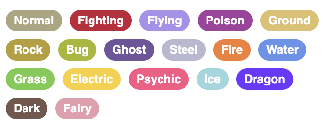

<details>
  <summary>Oplossing - PokemonTypeBadge component</summary>

```html
<script setup lang="ts">
  defineProps({
    type: {
      type: String,
      required: true,
      validator: (value) => {
        const validTypes = [
          'normal',
          'fighting',
          'flying',
          'poison',
          'ground',
          'rock',
          'bug',
          'ghost',
          'steel',
          'fire',
          'water',
          'grass',
          'electric',
          'psychic',
          'ice',
          'dragon',
          'dark',
          'fairy',
        ];
        return validTypes.includes(value.toString());
      },
    },
  });
</script>

<template>
  <span class="type" :class="`type-${type}`"> {{ type }} </span>
</template>

<style scoped>
  .type {
    padding: 0.25rem 0.5rem;
    border-radius: 1rem;
    text-align: center;
    font-weight: bold;
    text-transform: capitalize;
    color: var(--color-grayscale-white);
  }

  .type-normal {
    background-color: var(--type-normal);
  }

  .type-fighting {
    background-color: var(--type-fighting);
  }

  .type-flying {
    background-color: var(--type-flying);
  }

  .type-poison {
    background-color: var(--type-poison);
  }

  .type-ground {
    background-color: var(--type-ground);
  }

  .type-rock {
    background-color: var(--type-rock);
  }

  .type-bug {
    background-color: var(--type-bug);
  }

  .type-ghost {
    background-color: var(--type-ghost);
  }

  .type-steel {
    background-color: var(--type-steel);
  }

  .type-fire {
    background-color: var(--type-fire);
  }

  .type-water {
    background-color: var(--type-water);
  }

  .type-grass {
    background-color: var(--type-grass);
  }

  .type-electric {
    background-color: var(--type-electric);
  }

  .type-psychic {
    background-color: var(--type-psychic);
  }

  .type-ice {
    background-color: var(--type-ice);
  }

  .type-dragon {
    background-color: var(--type-dragon);
  }

  .type-dark {
    background-color: var(--type-dark);
  }

  .type-fairy {
    background-color: var(--type-fairy);
  }
</style>
```

</details>

#### Info item

Bij het analyseren van de info-items (weight, height, moves) valt op dat deze dezelfde structuur en styling hebben. Er is enkel afwijkend gedrag voor het moves-item.

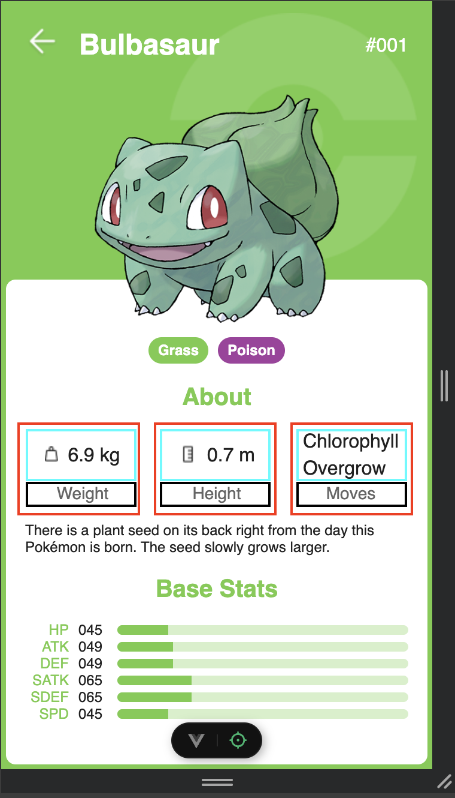

Het rode kader is identiek voor elk info-item, het zwarte kader is identiek voor elk info-item (de tekst is anders, maar de structuur en styling is identiek). Het blauwe kader is identiek voor het weight- en height-item, maar verschilt voor het moves-item.

Er kan nu beslist worden om een component te maken voor alles wat identiek is (rood en zwart kader) en een slot te gebruiken om de afwijkende delen (blauw kader) door te geven. Er kan ook beslist worden om alles in één component te plaatsen en via een prop te bepalen of het de alternatieve styling moet gebruiken. Er wordt gekozen voor de tweede optie.

Een mogelijke aanpak:

- Maak een component genaamd `InfoItem.vue` in de `components`-map.
- Definieer props voor:
  - een label (weight, height, moves)
  - een optionele src van de afbeelding (weight icon, height icon)
  - een optionele alt-tekst voor de afbeelding
  - een optionele tekst (weight value, height value)
  - een optionele array van waarden (voor moves)

In de component is logica aanwezig om te bepalen of de afbeelding en tekst getoond moeten worden, of dat de lijst met moves getoond moet worden. Als de lijst met moves wordt getoond, wordt de afwijkende styling toegepast.

De reden dat er voor `InfoItem.vue` gekozen wordt i.p.v. `PokemonInfoItem.vue` is omdat er geen directe koppeling is met de Pokémon-data. Dit component kan ook hergebruikt worden voor andere doeleinden indien nodig.

<details>
  <summary>Hint - Importeren van afbeelding</summary>

Doordat de afbeelding via `@/assets/` wordt ingeladen, kan deze niet rechtstreeks als `string`-prop worden doorgegeven. Vue heeft dan geen idee dat de afbeelding moet worden ingeladen. Om dit op te lossen, kan de afbeelding geïmporteerd worden in de `DetailView` en de ingeladen afbeelding kan dan als prop worden doorgegeven.

```js
import WeightIcon from '@/assets/img/weight.png';
```

```html
<InfoItem
  label="Weight"
  :src="WeightIcon"
  alt="Weight Icon"
  :text="selectedPokemon.weight + ' kg'"
/>
```

Mogelijks wordt er nu een TypeScript-fout getoond omdat de afbeelding wordt geïmporteerd zonder dat er een type-definitie voor is. Om dit op te lossen, kan er een `declaration file` worden toegevoegd aan het project.

`src/vite-env.d.ts`:

```ts
/// <reference types="vite/client" />

declare module '*.png' {
  const src: string;
  export default src;
}
declare module '*.jpg' {
  const src: string;
  export default src;
}
declare module '*.jpeg' {
  const src: string;
  export default src;
}
declare module '*.svg' {
  const src: string;
  export default src;
}
```

Hierdoor weet TypeScript dat wanneer er een afbeelding met deze extensies wordt geïmporteerd, dit resulteert in een `string`-waarde.

</details>

<details>
  <summary>Oplossing - InfoItem component</summary>

```html
<script setup lang="ts">
  defineProps({
    label: {
      type: String,
      required: true,
    },
    imageSrc: {
      type: String,
      required: false,
    },
    imageAlt: {
      type: String,
      required: false,
    },
    text: {
      type: String,
      required: false,
    },
    values: {
      type: Array,
      required: false,
    },
  });
</script>

<template>
  <section>
    <div
      class="info-data"
      :class="{
        'list-data': values && values.length,
      }"
    >
      <template v-if="imageSrc || text">
        
        {{ text }}
      </template>
      <template v-else-if="values && values.length">
        <div v-for="(value, index) in values" :key="index">{{ value }}</div>
      </template>
    </div>
    <div class="info-label">{{ label }}</div>
  </section>
</template>

<style scoped>
  section {
    display: flex;
    flex-direction: column;
    align-items: center;
    justify-content: space-between;
    gap: 0.25rem;
  }

  .info-data {
    display: flex;
    align-items: center;
    gap: 0.5rem;

    font-size: 1rem;
    flex: 1 1 auto;
  }

  .info-label {
    font-size: 0.875rem;
    color: var(--color-grayscale-medium);
  }

  .list-data {
    display: flex;
    flex-direction: column;
    align-items: flex-start;
    gap: 0.25rem;
  }
</style>
```

Dit zal worden geïmporteerd en gebruikt in de DetailView:

```js
import HeightIcon from '@/assets/img/height.png';
import WeightIcon from '@/assets/img/weight.png';
import InfoItem from '@/compontens/InfoItem.vue';
```

```html
<section class="info-section">
  <InfoItem
    label="Weight"
    :image-src="WeightIcon"
    image-alt="Weight Icon"
    :text="`${selectedPokemon.weight} kg`"
  />
  <InfoItem
    label="Height"
    :image-src="HeightIcon"
    image-alt="Height Icon"
    :text="`${selectedPokemon.height} m`"
  />
  <InfoItem label="Moves" :values="selectedPokemon.moves" />
</section>
```

</details>

#### Stat row

Maak een nieuw component genaamd `StatRow.vue` in de `components`-map. Verplaats de code van een stat-row (template en style) naar dit nieuwe component. Zorg ervoor dat de juiste props worden gedefinieerd om de stat-naam, waarde en de kleur (type) door te geven.

Er wordt opnieuw gekozen om een generieke naam te gebruiken (`StatRow.vue`) omdat er geen directe koppeling is met de Pokémon-data.

<details>
  <summary>Oplossing - StatRow component</summary>

```html
<script setup lang="ts">
  import { formatNumber } from '@/utils/formatting';

  defineProps({
    label: {
      type: String,
      required: true,
    },
    value: {
      type: Number,
      required: true,
    },
    color: {
      type: String,
      required: false,
      default: 'gray',
    },
  });
</script>

<template>
  <div class="detail-row">
    <span :style="{ color }"> {{ String(label).toUpperCase() }} </span>
    <span>{{ formatNumber(value) }}</span>
    <div
      class="progress"
      :style="{
        backgroundColor: `color-mix(in srgb, ${color} 30%, white)`,
      }"
    >
      <div
        class="progress-bar"
        :style="{
          width: `${(value / 255) * 100}%`,
          backgroundColor: `${color}`,
        }"
      ></div>
    </div>
  </div>
</template>

<style scoped>
  .detail-row {
    display: flex;
    align-items: center;
    gap: 0.5rem;
  }

  .detail-row span:first-child {
    width: 3rem;
  }
  .detail-row span:nth-child(2) {
    width: 2rem;
  }
  .detail-row span:first-child {
    text-align: right;
  }

  .progress {
    width: 100%;
    height: 0.5rem;
    border-radius: 1rem;
    overflow: hidden;
  }

  .progress-bar {
    height: 100%;
  }
</style>
```

Dit zal worden geïmporteerd en gebruikt in de DetailView:

```js
import StatRow from '@/compontens/StatRow.vue';
```

```html
<section class="stats-detail-section">
  <StatRow
    v-for="(value, stat) in selectedPokemon.stats"
    :key="stat"
    :label="stat.toString()"
    :value="value"
    :color="`var(--type-${selectedPokemon.types[0]})`"
  />
</section>
```

</details>

#### Section met titel en slot

| Identificatie in design                                                                                  | Identificatie in code                                                                                    |
| -------------------------------------------------------------------------------------------------------- | -------------------------------------------------------------------------------------------------------- |
|  | 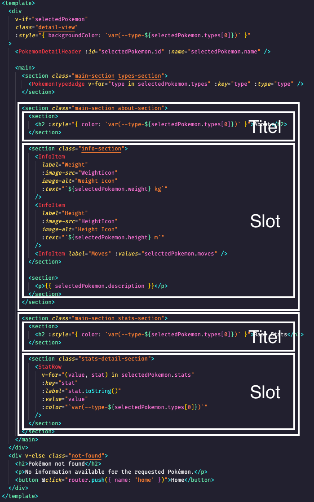 |

Maak een nieuw component genaamd `DetailViewSection.vue` in de `components`-map. Verplaats de code van een section met titel (script, template en style) naar dit nieuwe component. Zorg ervoor dat de juiste prop wordt gedefinieerd om de titel en kleur door te geven en gebruik een `slot` om de inhoud van de section door te geven.

<details>
  <summary>Oplossing - DetailViewSection component</summary>

```html
<script setup lang="ts">
  defineProps({
    title: {
      type: String,
      required: true,
    },
    color: {
      type: String,
      required: false,
      default: 'gray',
    },
  });
</script>
<template>
  <section class="detail-view-section">
    <section>
      <h2 :style="{ color }">{{ title }}</h2>
    </section>

    <slot></slot>
  </section>
</template>

<style scoped>
  .detail-view-section {
    width: 100%;
    display: flex;
    flex-direction: column;
    gap: 1rem;
  }

  h2 {
    font-size: 1.25rem;
    text-align: center;
  }
</style>
```

Dit zal worden geïmporteerd en gebruikt in de DetailView:

```js
import DetailViewSection from '@/compontens/DetailViewSection.vue';
```

```html
<main>
  <section class="types-section">
    <PokemonTypeBadge v-for="type in selectedPokemon.types" :key="type" :type="type" />
  </section>

  <DetailViewSection title="About" :color="`var(--type-${selectedPokemon.types[0]})`">
    <section class="info-section">
      <InfoItem
        label="Weight"
        :image-src="WeightIcon"
        image-alt="Weight Icon"
        :text="`${selectedPokemon.weight} kg`"
      />
      <InfoItem
        label="Height"
        :image-src="HeightIcon"
        image-alt="Height Icon"
        :text="`${selectedPokemon.height} m`"
      />
      <InfoItem label="Moves" :values="selectedPokemon.moves" />
    </section>

    <section>
      <p>{{ selectedPokemon.description }}</p>
    </section>
  </DetailViewSection>

  <DetailViewSection title="Base Stats" :color="`var(--type-${selectedPokemon.types[0]})`">
    <section class="stats-detail-section">
      <StatRow
        v-for="(value, stat) in selectedPokemon.stats"
        :key="stat"
        :label="stat.toString()"
        :value="value"
        :color="`var(--type-${selectedPokemon.types[0]})`"
      />
    </section>
  </DetailViewSection>
</main>
```

</details>

#### Not Found

Maak een nieuw component genaamd `PokemonNotFound.vue` in de `components`-map. Verplaats de code van de not-found sectie (script, template en style) naar dit nieuwe component.

<details>
  <summary>Oplossing - PokemonNotFound component</summary>

```html
<script setup lang="ts">
  import { useRouter } from 'vue-router';

  const router = useRouter();
</script>

<template>
  <div class="not-found">
    <h2>Pokémon not found</h2>
    <p>No information available for the requested Pokémon.</p>
    <button @click="router.push({ name: 'home' })">Home</button>
  </div>
</template>

<style scoped>
  .not-found {
    padding: 2rem;
    height: 100vh;
    display: flex;
    flex-direction: column;
    justify-content: center;
    align-items: center;
    gap: 1rem;
    background-color: var(--color-grayscale-white);
    color: var(--color-grayscale-dark);
    text-align: center;
  }

  button {
    padding: 0.5rem 1rem;
    border: none;
    border-radius: 4px;
    cursor: pointer;
    background-color: var(--color-grayscale-light);
  }
</style>
```

De knop kan op zich ook een component zijn, zolang deze niet op meerdere plaatsen wordt hergebruikt is het oké om dit te laten zoals het is.

</details>

#### Resultaat

De volledig herwerkte DetailView bestaat nu uit herbruikbare componenten die de code leesbaarder en onderhoudbaarder maken. De styling die overblijft in de DetailView is enkel de styling die nodig is om de pagina zelf te structureren.

<details>
  <summary>Oplossing - Volledige herwerkte DetailView code</summary>

```html
<script setup lang="ts">
  import HeightIcon from '@/assets/img/height.png';
  import WeightIcon from '@/assets/img/weight.png';
  import DetailViewSection from '@/compontens/DetailViewSection.vue';
  import InfoItem from '@/compontens/InfoItem.vue';
  import PokemonDetailHeader from '@/compontens/PokemonDetailHeader.vue';
  import PokemonNotFound from '@/compontens/PokemonNotFound.vue';
  import PokemonTypeBadge from '@/compontens/PokemonTypeBadge.vue';
  import StatRow from '@/compontens/StatRow.vue';
  import { onMounted, ref } from 'vue';
  import { useRoute } from 'vue-router';

  const route = useRoute();
  const selectedPokemon = ref(null);

  const pokemonList = ref([
    {
      id: 1,
      name: 'bulbasaur',
      types: ['grass', 'poison'],
      weight: 6.9,
      height: 0.7,
      moves: ['Chlorophyll', 'Overgrow'],
      description:
        'There is a plant seed on its back right from the day this Pokémon is born. The seed slowly grows larger.',
      stats: {
        hp: 45,
        atk: 49,
        def: 49,
        satk: 65,
        sdef: 65,
        spd: 45,
      },
    },
    {
      id: 4,
      name: 'charmander',
      types: ['fire'],
      weight: 8.5,
      height: 0.6,
      moves: ['Mega-Punch', 'Fire-Punch'],
      description:
        'It has a preference for hot things. When it rains, steam is said to spout from the tip of its tail.',
      stats: {
        hp: 39,
        atk: 52,
        def: 43,
        satk: 60,
        sdef: 50,
        spd: 65,
      },
    },
    {
      id: 7,
      name: 'squirtle',
      types: ['water'],
      weight: 9.0,
      height: 0.5,
      moves: ['Torrent', 'Rain-Dish'],
      description:
        'When it retracts its long neck into its shell, it squirts out water with vigorous force.',
      stats: {
        hp: 44,
        atk: 48,
        def: 65,
        satk: 50,
        sdef: 64,
        spd: 43,
      },
    },
    {
      id: 25,
      name: 'pikachu',
      types: ['electric'],
      weight: 6.0,
      height: 0.4,
      moves: ['Mega-Punch', 'Pay-Day'],
      description:
        'Pikachu that can generate powerful electricity have cheek sacs that are extra soft and super stretchy.',
      stats: {
        hp: 35,
        atk: 55,
        def: 40,
        satk: 50,
        sdef: 50,
        spd: 90,
      },
    },
  ]);

  onMounted(() => {
    const pokemonId = Number(route.params.id);
    selectedPokemon.value = pokemonList.value.find((pokemon) => pokemon.id === pokemonId);
  });
</script>
<template>
  <div
    v-if="selectedPokemon"
    class="detail-view"
    :style="{ backgroundColor: `var(--type-${selectedPokemon.types[0]})` }"
  >
    <PokemonDetailHeader :id="selectedPokemon.id" :name="selectedPokemon.name" />

    <main>
      <section class="types-section">
        <PokemonTypeBadge v-for="type in selectedPokemon.types" :key="type" :type="type" />
      </section>

      <DetailViewSection title="About" :color="`var(--type-${selectedPokemon.types[0]})`">
        <section class="info-section">
          <InfoItem
            label="Weight"
            :image-src="WeightIcon"
            image-alt="Weight Icon"
            :text="`${selectedPokemon.weight} kg`"
          />
          <InfoItem
            label="Height"
            :image-src="HeightIcon"
            image-alt="Height Icon"
            :text="`${selectedPokemon.height} m`"
          />
          <InfoItem label="Moves" :values="selectedPokemon.moves" />
        </section>

        <section>
          <p>{{ selectedPokemon.description }}</p>
        </section>
      </DetailViewSection>

      <DetailViewSection title="Base Stats" :color="`var(--type-${selectedPokemon.types[0]})`">
        <section class="stats-detail-section">
          <StatRow
            v-for="(value, stat) in selectedPokemon.stats"
            :key="stat"
            :label="stat.toString()"
            :value="value"
            :color="`var(--type-${selectedPokemon.types[0]})`"
          />
        </section>
      </DetailViewSection>
    </main>
  </div>
  <PokemonNotFound v-else />
</template>

<style scoped>
  .detail-view {
    height: 100vh;
    background-color: var(--type-grass);
    padding: 0.25rem;

    display: flex;
    flex-direction: column;
  }

  main {
    background-color: var(--color-grayscale-white);
    border-radius: 8px;
    padding: 1rem;
    flex-grow: 1;
    overflow-y: auto;

    display: flex;
    flex-direction: column;
    gap: 1rem;
    padding-top: 3rem;

    font-size: 0.75rem;
  }

  .info-section {
    display: flex;
    justify-content: space-evenly;
    gap: 1rem;
  }

  .info-section > section {
    flex: 1 1 33%;
  }

  .types-section {
    display: flex;
    gap: 0.5rem;
    justify-content: center;
  }
</style>
```

Er kan nog beslist worden om de verschillende secties te verplaatsen naar aparte componenten, puur op basis van leesbaarheid. Het eindresultaat zou er dan als volgt uit kunnen zien:

```html
<template>
  <div
    v-if="selectedPokemon"
    class="detail-view"
    :style="{ backgroundColor: `var(--type-${selectedPokemon.types[0]})` }"
  >
    <PokemonDetailHeader :id="selectedPokemon.id" :name="selectedPokemon.name" />

    <main>
      <PokemonTypesSection :types="selectedPokemon.types" />

      <PokemonAboutSection :pokemon="selectedPokemon" />

      <PokemonBaseStatsSection :pokemon="selectedPokemon" />
    </main>
  </div>
  <PokemonNotFound v-else />
</template>
```

Voor deze opdracht wordt er besloten om dit niet verder uit te werken.

</details>

## State management (2 uur)

Momenteel wordt per pagina (ListView en DetailView) een `lokale state` gebruikt om de Pokémon-data te voorzien. In de component zelf (lokaal) wordt er een lijst met Pokémon (state) gedefinieerd. Dit is niet ideaal, als er een item wordt toegevoegd, verwijderd of aangepast in de lijst, moet dit op meerdere plaatsen gebeuren.

Een betere aanpak is om een `centrale state` te gebruiken, de data staat op één plaats en kan door alle componenten die het nodig hebben, worden gebruikt. In Vue 3 wordt er vaak gebruik gemaakt van `Pinia` om deze centrale state te beheren.

Huidige situatie

| ListView local state                                                               | DetailView local state                                                                 |
| ---------------------------------------------------------------------------------- | -------------------------------------------------------------------------------------- |
| 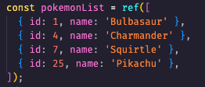 | 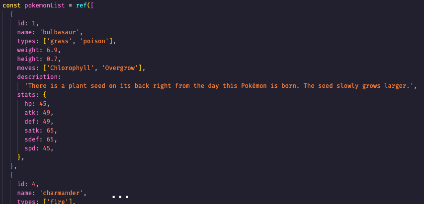 |

De data van de ListView (id en name) komt ook terug in de DetailView, maar dan uitgebreid met alle details van de Pokémon. De data van de DetailView zal verplaatst worden naar een `Pinia store`. De ListView en DetailView zullen deze store gebruiken om de benodigde data te gebruiken.

Maak een bestand genaamd `pokemon.js` aan in de `stores`-map van het project. Definieer hierin een Pinia store genaamd `usePokemonStore`. Verplaats de Pokémon-data van de DetailView naar deze store.

<details>
  <summary>Oplossing - Pinia store</summary>

```js
import { defineStore } from 'pinia';
import { ref } from 'vue';

export const usePokemonStore = defineStore('pokemon', () => {
  const pokemonList = ref([
    {
      id: 1,
      name: 'bulbasaur',
      types: ['grass', 'poison'],
      weight: 6.9,
      height: 0.7,
      moves: ['Chlorophyll', 'Overgrow'],
      description:
        'There is a plant seed on its back right from the day this Pokémon is born. The seed slowly grows larger.',
      stats: {
        hp: 45,
        atk: 49,
        def: 49,
        satk: 65,
        sdef: 65,
        spd: 45,
      },
    },
    {
      id: 4,
      name: 'charmander',
      types: ['fire'],
      weight: 8.5,
      height: 0.6,
      moves: ['Mega-Punch', 'Fire-Punch'],
      description:
        'It has a preference for hot things. When it rains, steam is said to spout from the tip of its tail.',
      stats: {
        hp: 39,
        atk: 52,
        def: 43,
        satk: 60,
        sdef: 50,
        spd: 65,
      },
    },
    {
      id: 7,
      name: 'squirtle',
      types: ['water'],
      weight: 9.0,
      height: 0.5,
      moves: ['Torrent', 'Rain-Dish'],
      description:
        'When it retracts its long neck into its shell, it squirts out water with vigorous force.',
      stats: {
        hp: 44,
        atk: 48,
        def: 65,
        satk: 50,
        sdef: 64,
        spd: 43,
      },
    },
    {
      id: 25,
      name: 'pikachu',
      types: ['electric'],
      weight: 6.0,
      height: 0.4,
      moves: ['Mega-Punch', 'Pay-Day'],
      description:
        'Pikachu that can generate powerful electricity have cheek sacs that are extra soft and super stretchy.',
      stats: {
        hp: 35,
        atk: 55,
        def: 40,
        satk: 50,
        sdef: 50,
        spd: 90,
      },
    },
  ]);

  return {
    pokemonList,
  };
});
```

</details>

Importeer en gebruik de store in zowel de ListView als de DetailView om de Pokémon-data te verkrijgen. `storeToRefs` kan gebruikt worden om de reactiviteit van de state te behouden tijdens het `destructuren`. Een alternatief is om rechtstreeks de store te koppelen in de template via `pokemonStore.pokemonList`, met het destructuren via `storeToRefs()` hoeft er niks gewijzigd te worden in de template.

Voor de wijziging in ListView:

```js
const pokemonList = ref([
  { id: 1, name: 'Bulbasaur' },
  { id: 4, name: 'Charmander' },
  { id: 7, name: 'Squirtle' },
  { id: 25, name: 'Pikachu' },
]);
```

Na de wijziging in ListView:

```js
import { usePokemonStore } from '@/stores/pokemon';
import { storeToRefs } from 'pinia';

const pokemonStore = usePokemonStore();
const { pokemonList } = storeToRefs(pokemonStore);
```

Voor de wijziging in DetailView:

```js
const pokemonList = ref([
  // Hier alle objecten met Pokémon-data
]);
```

Na de wijziging in DetailView:

```js
import { usePokemonStore } from '@/stores/pokemon';
import { storeToRefs } from 'pinia';

const pokemonStore = usePokemonStore();
const { pokemonList } = storeToRefs(pokemonStore);
```

In de DetailView is er ook lokale state aanwezig voor `selectedPokemon`, deze kan lokaal blijven omdat dit enkel relevant is op de DetailView-pagina. Het ophalen van de geselecteerde Pokémon uit de lijst kan wel verplaatst worden naar de `pokemonStore`.

Voor de wijziging in DetailView:

```js
const selectedPokemon = ref(null);

const pokemonStore = usePokemonStore();
const { pokemonList } = storeToRefs(pokemonStore);

onMounted(() => {
  const pokemonId = Number(route.params.id);
  selectedPokemon.value = pokemonList.value.find((pokemon) => pokemon.id === pokemonId);
});
```

Na de wijziging in DetailView:

```js
const pokemonStore = usePokemonStore();
const { getPokemonById } = pokemonStore;

onMounted(() => {
  const pokemonId = Number(route.params.id);
  selectedPokemon.value = getPokemonById(pokemonId);
});
```

> Merk op dat de functie `getPokemonById` rechtstreeks destructured wordt vanuit de store, zonder `storeToRefs()`. Functies in Pinia stores hoeven niet reactief te zijn, dus deze kunnen rechtstreeks gebruikt worden.

## API-integratie (8 uur)

Bekijk de documentatie van de [PokéAPI /pokemon end point](https://pokeapi.co/docs/v2#pokemon). Wijzig de Pinia store zodat de Pokémon-data wordt opgehaald vanuit deze API in plaats van dat deze data hard-coded in de store staat.

Bij het bestuderen van de API-documentatie valt op dat de `/pokemon` endpoint niet alle data bevat die momenteel in de store staat (weight, height, stats, ...). De data van de DetailView kan verkregen worden via de `/pokemon/{id}` endpoint.

Er zullen twee functionaliteiten toegevoegd worden aan de store:

- Een functie `fetchPokemonList` die de lijst met Pokémon ophaalt vanuit de `/pokemon` endpoint. De data die terugkomt van de endpoint zal gemapped moeten worden naar het formaat dat momenteel in de store staat (id en name).
- Een functie `fetchPokemonById` die de details van een specifieke Pokémon ophaalt vanuit de `/pokemon/{id}` endpoint. De data die terugkomt van de endpoint zal gemapped moeten worden naar het formaat dat momenteel in de store staat.

### ListView

De endpoint is `https://pokeapi.co/api/v2/pokemon`, waaruit het volgende resultaat terugkomt:

```json
{
  "count": 1350,
  "next": "https://pokeapi.co/api/v2/pokemon?offset=20&limit=20",
  "previous": null,
  "results": [
    {
      "name": "bulbasaur",
      "url": "https://pokeapi.co/api/v2/pokemon/1/"
    },
    {
      "name": "ivysaur",
      "url": "https://pokeapi.co/api/v2/pokemon/2/"
    },
    ...
  ]
}
```

Hetgeen terugkomt is een object met daarin de totale `count` van Pokémon die beschikbaar zijn, een `next`- en `previous`-link waarmee de volgende of vorige groep Pokémon kan worden opgehaald (voor paginatie) en een `results`-array met daarin de Pokémon (name en url).

De applicatie verwacht echter een array met objecten die een `id` en `name` bevatten. Momenteel bevat de `results`-array enkel de `name` en een `url`. De `id` kan afgeleid worden uit de `url`, de data zal dus `getransformeerd` moeten worden naar het juiste ormaat.

Hetgeen zal toegevoegd/gewijzigd worden in de Pinia store:

- De initiële waarde van `pokemonList` zal een lege array zijn.
- Er zal een nieuwe functie `fetchPokemonList` worden toegevoegd die de data ophaalt vanuit de API en deze transformeert naar het juiste formaat en vervolgens toekent aan `pokemonList`.

<details>
  <summary>Hint - omzetten van url naar id</summary>

De `url`-string kan opgesplitst worden op de `/`-karakters, waardoor er een array ontstaat. Het `id`-gedeelte bevindt zich op de voorlaatste positie van deze array.

bv. `https://pokeapi.co/api/v2/pokemon/1/` wordt opgesplitst naar:

```js
['https:', '', 'pokeapi.co', 'api', 'v2', 'pokemon', '1', ''];
```

Het `id`-gedeelte bevindt zich op index `length - 2` van deze array.

```js
const url = 'https://pokeapi.co/api/v2/pokemon/1/';
const splittedUrl = url.split('/');
const id = Number(splittedUrl[splittedUrl.length - 2]);
```

</details>

<details>
  <summary>Oplossing - fetchPokemonList functie</summary>

```js
import { defineStore } from 'pinia';
import { ref } from 'vue';

export const usePokemonStore = defineStore('pokemon', () => {
  const pokemonList = ref([]);

  async function fetchPokemonList() {
    const response = await fetch('https://pokeapi.co/api/v2/pokemon');
    const data = await response.json();

    const list = data.results;
    pokemonList.value = list.map((pokemon) => {
      const splittedUrl = pokemon.url.split('/');
      const id = Number(splittedUrl[splittedUrl.length - 2]);
      return {
        id,
        name: pokemon.name,
      };
    });
  }

  function getPokemonById(id) {
    return pokemonList.value.find((pokemon) => pokemon.id === Number(id));
  }

  return {
    pokemonList,
    fetchPokemonList,
    getPokemonById,
  };
});
```

</details>

Gebruik de nieuwe `fetchPokemonList` functie in de ListView om de data op te halen bij het laden van de pagina. Dit kan gedaan worden in de `onMounted` lifecycle hook.

```js
const { pokemonList } = storeToRefs(pokemonStore);
const { fetchPokemonList } = pokemonStore;

onMounted(async () => {
  await fetchPokemonList();
});
```

Om te zorgen dat de eerste originele 151 Pokémon worden opgehaald, kan de URL aangepast worden naar `https://pokeapi.co/api/v2/pokemon?limit=151`.

Merk op dat de naam nu in lowercase wordt getoond, voeg CSS toe om de eerste letter van de naam in hoofdletter te tonen (in `PokemonListItem.vue`).


Op dit moment zal de DetailView tijdelijk niet meer werken omdat de `pokemonList` initieel leeg is. Zelfs als `fetchPokemonList` wordt aangeroepen in de ListView, zal de DetailView nog steeds niet werken omdat de Pokémon-data niet volledig is. Enkel de `id` en `name` zijn aanwezig.

### DetailView

Momenteel worden de details van één Pokémon opgehaald via `getPokemonById`, deze functie filtert de Pokémon uit de `pokemonList` array. Deze functie zal aangepast worden zodat deze de data rechtstreeks ophaalt vanuit de API. Om beter onderscheid te maken tussen de oude en nieuwe functie, zal de naam gewijzigd worden naar `fetchPokemonById`, omdat deze de data nu via een `fetch` zal ophalen i.p.v. te filteren uit de bestaande lijst.

Bij het ophalen van de data vanuit de API, zal de data `getransformeerd` moeten worden naar het formaat dat in de frontend wordt gebruikt.

Bekijk de response van [https://pokeapi.co/api/v2/pokemon/1/](https://pokeapi.co/api/v2/pokemon/1/) om te zien wat voor data er terugkomt:

<details>
  <summary>Simpele weergave van /pokemon/{id} endpoint</summary>

```json
{
  "abilities": [
    {
      "ability": {
        "name": "overgrow",
        "url": "https://pokeapi.co/api/v2/ability/65/"
      },
      "is_hidden": false,
      "slot": 1
    },
    {
      "ability": {
        "name": "chlorophyll",
        "url": "https://pokeapi.co/api/v2/ability/34/"
      },
      "is_hidden": true,
      "slot": 3
    }
  ],
  "base_experience": 64,
  "cries": {
    /*...*/
  },
  "forms": [
    /*...*/
  ],
  "game_indices": [
    /*...*/
  ],
  "height": 7,
  "held_items": [],
  "id": 1,
  "is_default": true,
  "location_area_encounters": "https://pokeapi.co/api/v2/pokemon/1/encounters",
  "moves": [
    {
      "move": {
        "name": "razor-wind",
        "url": "https://pokeapi.co/api/v2/move/13/"
      },
      "version_group_details": [
        /*...*/
      ]
    },
    {
      "move": {
        "name": "swords-dance",
        "url": "https://pokeapi.co/api/v2/move/14/"
      },
      "version_group_details": [
        /*...*/
      ]
    }
    /*...*/
  ],
  "name": "bulbasaur",
  "order": 1,
  "past_abilities": [
    /*...*/
  ],
  "past_types": [],
  "species": {
    "name": "bulbasaur",
    "url": "https://pokeapi.co/api/v2/pokemon-species/1/"
  },
  "sprites": {
    /*...*/
  },
  "stats": [
    {
      "base_stat": 45,
      "effort": 0,
      "stat": {
        "name": "hp",
        "url": "https://pokeapi.co/api/v2/stat/1/"
      }
    },
    {
      "base_stat": 49,
      "effort": 0,
      "stat": {
        "name": "attack",
        "url": "https://pokeapi.co/api/v2/stat/2/"
      }
    },
    {
      "base_stat": 49,
      "effort": 0,
      "stat": {
        "name": "defense",
        "url": "https://pokeapi.co/api/v2/stat/3/"
      }
    },
    {
      "base_stat": 65,
      "effort": 1,
      "stat": {
        "name": "special-attack",
        "url": "https://pokeapi.co/api/v2/stat/4/"
      }
    },
    {
      "base_stat": 65,
      "effort": 0,
      "stat": {
        "name": "special-defense",
        "url": "https://pokeapi.co/api/v2/stat/5/"
      }
    },
    {
      "base_stat": 45,
      "effort": 0,
      "stat": {
        "name": "speed",
        "url": "https://pokeapi.co/api/v2/stat/6/"
      }
    }
  ],
  "types": [
    {
      "slot": 1,
      "type": {
        "name": "grass",
        "url": "https://pokeapi.co/api/v2/type/12/"
      }
    },
    {
      "slot": 2,
      "type": {
        "name": "poison",
        "url": "https://pokeapi.co/api/v2/type/4/"
      }
    }
  ],
  "weight": 69
}
```

</details>

Hier valt op dat hetgeen bij `abilities` staat, overeenkomt met wat in het design bij `moves` staat. En voor `moves` is er andere data aanwezig. Omdat er nu `moves`-data beschikbaar is, zal deze gebruikt worden.

De data zal getransformeerd moeten worden naar het volgende formaat:

```json
{
  "id": 1,
  "name": "bulbasaur",
  "types": ["grass", "poison"],
  "weight": 6.9,
  "height": 0.7,
  "moves": ["Chlorophyll", "Overgrow"],
  "description": "There is a plant seed on its back right from the day this Pokémon is born. The seed slowly grows larger.",
  "stats": {
    "hp": 45,
    "atk": 49,
    "def": 49,
    "satk": 65,
    "sdef": 65,
    "spd": 45
  }
}
```

Enkele zaken om rekening mee te houden:

- `weight` en `height` worden in de API teruggegeven in hectogram en decimeter, in de frontend worden deze getoond in kilogram en meter. De waarden moeten dus gedeeld worden door 10.
- `types` is een array van objecten in de API, in de frontend is dit een array van strings.
- `moves` is een array van objecten in de API, in de frontend is dit een array van strings. Haal twee moves op uit de API response en gebruik deze (extra uitdaging: neem twee willekeurige moves).
- `stats` is een array van objecten in de API, in de frontend is dit een object met key-value paren. De stat-namen in de API zijn anders dan in de frontend (bijv. `special-attack` vs `satk`), deze moeten dus gemapped worden naar de juiste naam.

Voor de wijziging:

```js
function getPokemonById(id) {
  return pokemonList.value.find((pokemon) => pokemon.id === Number(id));
}
```

Na de wijziging:

```js
function getRandomMoves(moves, amount = 2) {
  const randomMoves = [...moves].sort(() => 0.5 - Math.random()).slice(0, amount);
  const names = randomMoves.map((item) => item.move.name);
  return names;
}

async function fetchPokemonById(id) {
  const result = await fetch(`https://pokeapi.co/api/v2/pokemon/${id}`);
  const data = await result.json();

  const pokemon = {
    id: data.id,
    name: data.name,
    types: data.types.map((item) => item.type.name),
    weight: data.weight / 10,
    height: data.height / 10,
    moves: getRandomMoves(data.moves),
    description: 'NOG NIET GEKEND',
    stats: {
      hp: data.stats.find((item) => item.stat.name === 'hp').base_stat,
      atk: data.stats.find((item) => item.stat.name === 'attack').base_stat,
      def: data.stats.find((item) => item.stat.name === 'defense').base_stat,
      satk: data.stats.find((item) => item.stat.name === 'special-attack').base_stat,
      sdef: data.stats.find((item) => item.stat.name === 'special-defense').base_stat,
      spd: data.stats.find((item) => item.stat.name === 'speed').base_stat,
    },
  };

  return pokemon;
}
```

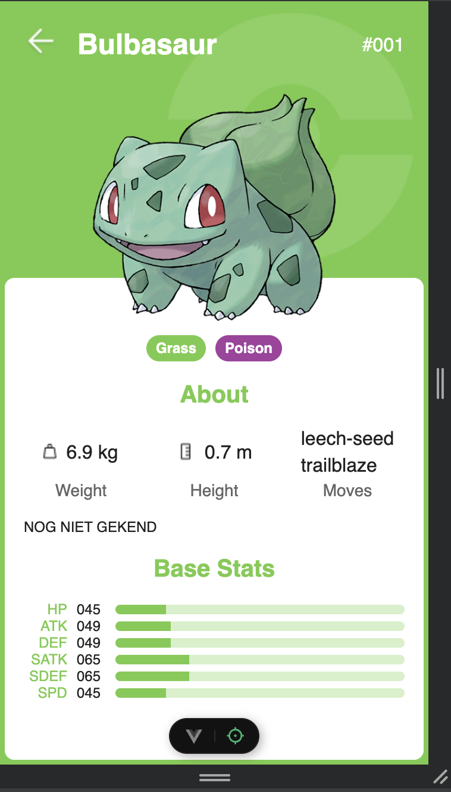

Merk op dat de `description` nog niet gekend is. En de moves worden in kleine letters getoond en met een koppelteken in plaats van een spatie.

Maak een functie aan om de naam om te zetten naar: elk woord met een hoofdletter en elk koppelteken vervangen door een spatie. Als de naam `solar-power` is, moet deze worden omgezet naar `Solar Power`. Indien deze functie later op meerdere plaatsen nodig is, kan deze verplaatst worden naar `src/utils/formatting.js`.

De eigenschap `description` is niet aanwezig in de response van `/pokemon/{id}`. Deze kan opgehaald worden via de `/pokemon-species/{id}` endpoint. De url hiervoor is aanwezig in de API response bij `species.url`. Er zal dus een tweede fetch uitgevoerd moeten worden om de `description` op te halen.

Bekijk de response van [https://pokeapi.co/api/v2/pokemon-species/1/](https://pokeapi.co/api/v2/pokemon-species/1/) om te zien wat voor data er terugkomt:

<details>
  <summary>Simpele weergave van /pokemon-species/{id} endpoint</summary>

```json
{
  "base_happiness": 70,
  "capture_rate": 45,
  "color": {
    "name": "green",
    "url": "https://pokeapi.co/api/v2/pokemon-color/5/"
  },
  "egg_groups": [
    /*...*/
  ],
  "evolution_chain": {
    "url": "https://pokeapi.co/api/v2/evolution-chain/1/"
  },
  "evolves_from_species": null,
  "flavor_text_entries": [
    {
      "flavor_text": "A strange seed was\nplanted on its\nback at birth.\fThe plant sprouts\nand grows with\nthis POKéMON.",
      "language": {
        "name": "en",
        "url": "https://pokeapi.co/api/v2/language/9/"
      },
      "version": {
        "name": "red",
        "url": "https://pokeapi.co/api/v2/version/1/"
      }
    },
    {
      "flavor_text": "A strange seed was\nplanted on its\nback at birth.\fThe plant sprouts\nand grows with\nthis POKéMON.",
      "language": {
        "name": "en",
        "url": "https://pokeapi.co/api/v2/language/9/"
      },
      "version": {
        "name": "blue",
        "url": "https://pokeapi.co/api/v2/version/2/"
      }
    },
    /*...*/
    {
      "flavor_text": "Au matin de sa vie, la graine sur\nson dos lui fournit les éléments\ndont il a besoin pour grandir.",
      "language": {
        "name": "fr",
        "url": "https://pokeapi.co/api/v2/language/5/"
      },
      "version": {
        "name": "black",
        "url": "https://pokeapi.co/api/v2/version/17/"
      }
    },
    /*...*/
    {
      "flavor_text": "うまれたときから　せなかに\nふしぎな　タネが　うえてあって\nからだと　ともに　そだつという。",
      "language": {
        "name": "ja-Hrkt",
        "url": "https://pokeapi.co/api/v2/language/1/"
      },
      "version": {
        "name": "x",
        "url": "https://pokeapi.co/api/v2/version/23/"
      }
    },
    /*...*/
    {
      "flavor_text": "While it is young, it uses the nutrients that are\nstored in the seed on its back in order to grow.",
      "language": {
        "name": "en",
        "url": "https://pokeapi.co/api/v2/language/9/"
      },
      "version": {
        "name": "shield",
        "url": "https://pokeapi.co/api/v2/version/34/"
      }
    }
    /*...*/
  ],
  "form_descriptions": [],
  "forms_switchable": false,
  "gender_rate": 1,
  "genera": [
    /*...*/
  ],
  "generation": {
    "name": "generation-i",
    "url": "https://pokeapi.co/api/v2/generation/1/"
  },
  "growth_rate": {
    "name": "medium-slow",
    "url": "https://pokeapi.co/api/v2/growth-rate/4/"
  },
  "habitat": {
    "name": "grassland",
    "url": "https://pokeapi.co/api/v2/pokemon-habitat/3/"
  },
  "has_gender_differences": false,
  "hatch_counter": 20,
  "id": 1,
  "is_baby": false,
  "is_legendary": false,
  "is_mythical": false,
  "name": "bulbasaur",
  "names": [
    /*...*/
  ],
  "order": 1,
  "pal_park_encounters": [
    /*..**/
  ],
  "pokedex_numbers": [
    /*...*/
  ],
  "shape": {
    "name": "quadruped",
    "url": "https://pokeapi.co/api/v2/pokemon-shape/8/"
  },
  "varieties": [
    {
      "is_default": true,
      "pokemon": {
        "name": "bulbasaur",
        "url": "https://pokeapi.co/api/v2/pokemon/1/"
      }
    }
  ]
}
```

</details>

De `description` is terug te vinden in de `flavor_text_entries` array. In deze array staan meerdere objecten met een `flavor_text` eigenschap, maar ook een `language` eigenschap. Enkel de `flavor_text` waar de `language.name` gelijk is aan `en` (Engels) moet gebruikt worden. Filter alle items in de array waarvan de taal Engels is. Neem vervolgens een willekeurig item uit deze gefilterde lijst en gebruik de `flavor_text` als de `description`.

<details>
  <summary>Oplossing - fetchPokemonById met description</summary>

```js
function getRandomItems(items, amount = 1) {
  const randomItems = [...items].sort(() => 0.5 - Math.random()).slice(0, amount);
  return randomItems;
}

function getRandomMoves(moves, amount = 2) {
  const randomMoves = getRandomItems(moves, amount);
  const names = randomMoves.map((item) => item.move.name);
  return names;
}

function formatMoveName(move) {
  return move
    .split('-')
    .map((word) => word.charAt(0).toUpperCase() + word.slice(1))
    .join(' ');
}

function getRandomDescription(options) {
  const englishOptions = options.filter((item) => item.language.name === 'en');
  const randomItems = getRandomItems(englishOptions);
  const randomItem = randomItems[0];
  const description = randomItem.flavor_text;
  return description;
}

async function fetchPokemonById(id) {
  const response = await fetch(`https://pokeapi.co/api/v2/pokemon/${id}`);
  const data = await response.json();

  const pokemonSpeciesResponse = await fetch(data.species.url);
  const pokemonSpeciesData = await pokemonSpeciesResponse.json();
  const description = getRandomDescription(pokemonSpeciesData.flavor_text_entries);

  const randomMoves = getRandomMoves(data.moves);
  const moves = randomMoves.map((move) => formatMoveName(move));

  const pokemon = {
    id: data.id,
    name: data.name,
    types: data.types.map((item) => item.type.name),
    weight: data.weight / 10,
    height: data.height / 10,
    moves,
    description,
    stats: {
      hp: data.stats.find((item) => item.stat.name === 'hp').base_stat,
      atk: data.stats.find((item) => item.stat.name === 'attack').base_stat,
      def: data.stats.find((item) => item.stat.name === 'defense').base_stat,
      satk: data.stats.find((item) => item.stat.name === 'special-attack').base_stat,
      sdef: data.stats.find((item) => item.stat.name === 'special-defense').base_stat,
      spd: data.stats.find((item) => item.stat.name === 'speed').base_stat,
    },
  };

  return pokemon;
}
```

Merk op dat zowel `getRandomMoves` als `getRandomDescription` gebruik maken van dezelfde `getRandomItems`-functie. `getRandomItems` kan verplaatst worden naar `src/utils/array.js` en vervolgens geïmporteerd worden zodat deze op meerdere plaatsen hergebruikt kan worden. In het huidige project blijft het in de store staan tot het buiten dit bestand ook nodig is.

</details>

In de DetailView zal `fetchPokemonById` aangeroepen moeten worden in plaats van `getPokemonById`.

```js
const selectedPokemon = ref(null);

const pokemonStore = usePokemonStore();
const { fetchPokemonById } = pokemonStore;

onMounted(async () => {
  const pokemonId = Number(route.params.id);
  selectedPokemon.value = await fetchPokemonById(pokemonId);
});
```

> Merk op dat `onMounted` nu `async` is, zodat er gewacht kan worden op de fetch-functie.

### Loading indicator

Doordat de fetch-functies asynchroon zijn, kan het even duren voordat de data beschikbaar is. Op langzamere verbindingen kan dit enkele seconden duren. Tijdens het wachten op de data is er op de ListView momenteel een wit scherm te zien en op de DetailView wordt de "Pokémon not found"-component getoond. Dit is niet ideaal voor de gebruikerservaring.

Om dit op te lossen zal er `Loading ...`-tekst getoond worden op beide pagina's terwijl er gewacht wordt op de data.

De state zal uitgebreid worden met een `isLoading` boolean die op `true` wordt gezet voor de fetch-aanroep en op `false` nadat de data is opgehaald.

<details>
  <summary>Oplossing - volledige Pinia store met loading state</summary>

```js
import { defineStore } from 'pinia';
import { ref } from 'vue';

export const usePokemonStore = defineStore('pokemon', () => {
  const pokemonList = ref([]);
  const isLoading = ref(true); // dit is toegevoegd

  async function fetchPokemonList() {
    isLoading.value = true; // dit is toegevoegd

    const response = await fetch('https://pokeapi.co/api/v2/pokemon?limit=151');
    const data = await response.json();

    const list = data.results;
    pokemonList.value = list.map((pokemon) => {
      const splittedUrl = pokemon.url.split('/');
      const id = Number(splittedUrl[splittedUrl.length - 2]);
      return {
        id,
        name: pokemon.name,
      };
    });

    isLoading.value = false; // dit is toegevoegd
  }

  function getRandomItems(items, amount = 1) {
    const randomItems = [...items].sort(() => 0.5 - Math.random()).slice(0, amount);
    return randomItems;
  }

  function getRandomMoves(moves, amount = 2) {
    const randomMoves = getRandomItems(moves, amount);
    const names = randomMoves.map((item) => item.move.name);
    return names;
  }

  function formatMoveName(move) {
    return move
      .split('-')
      .map((word) => word.charAt(0).toUpperCase() + word.slice(1))
      .join(' ');
  }

  function getRandomDescription(options) {
    const englishOptions = options.filter((item) => item.language.name === 'en');
    const randomItems = getRandomItems(englishOptions);
    const randomItem = randomItems[0];
    const description = randomItem.flavor_text;
    return description;
  }

  async function fetchPokemonById(id) {
    isLoading.value = true; // dit is toegevoegd

    const response = await fetch(`https://pokeapi.co/api/v2/pokemon/${id}`);
    const data = await response.json();

    const pokemonSpeciesResponse = await fetch(data.species.url);
    const pokemonSpeciesData = await pokemonSpeciesResponse.json();
    const description = getRandomDescription(pokemonSpeciesData.flavor_text_entries);

    const randomMoves = getRandomMoves(data.moves);
    const moves = randomMoves.map((move) => formatMoveName(move));

    const pokemon = {
      id: data.id,
      name: data.name,
      types: data.types.map((item) => item.type.name),
      weight: data.weight / 10,
      height: data.height / 10,
      moves,
      description,
      stats: {
        hp: data.stats.find((item) => item.stat.name === 'hp').base_stat,
        atk: data.stats.find((item) => item.stat.name === 'attack').base_stat,
        def: data.stats.find((item) => item.stat.name === 'defense').base_stat,
        satk: data.stats.find((item) => item.stat.name === 'special-attack').base_stat,
        sdef: data.stats.find((item) => item.stat.name === 'special-defense').base_stat,
        spd: data.stats.find((item) => item.stat.name === 'speed').base_stat,
      },
    };

    isLoading.value = false; // dit is toegevoegd

    return pokemon;
  }

  return {
    pokemonList,
    fetchPokemonList,
    fetchPokemonById,
    isLoading, // dit is toegevoegd
  };
});
```

</details>

Voorzie een `LoadingIndicator.vue`-component in de `components`-map die de `Loading ...`-tekst toont. Er wordt styling voorzien om de tekst in het midden van het scherm te tonen en de component zal altijd de volledige breedte en hoogte van het scherm innemen.

```html
<template>
  <div class="loading">
    <p>Loading ...</p>
  </div>
</template>

<style scoped>
  .loading {
    height: 100vh;
    display: flex;
    justify-content: center;
    align-items: center;
    background-color: var(--color-primary);
    color: var(--color-grayscale-white);
    font-size: 1.5rem;
  }
</style>
```

In de ListView en DetailView zal de template aangepast worden om de `LoadingIndicator`-component te tonen indien `isLoading` op `true` staat.

DetailView voorbeeld:

```js
const pokemonStore = usePokemonStore();
const { isLoading } = storeToRefs(pokemonStore);
```

```html
<LoadingIndicator v-if="isLoading" />
<div
  v-if="selectedPokemon && !isLoading"
  class="detail-view"
  :style="{ backgroundColor: `var(--type-${selectedPokemon.types[0]})` }"
>
  <!-- DetailView content -->
</div>
<PokemonNotFound v-else-if="!isLoading" />
```

ListView voorbeeld:

```js
const pokemonStore = usePokemonStore();
const { pokemonList, isLoading } = storeToRefs(pokemonStore);
```

```html
<template>
  <LoadingIndicator v-if="isLoading" />
  <div v-else class="list-view">
    <PokemonListHeader />
    <main>
      <PokemonList>
        <PokemonListItem
          v-for="pokemon in pokemonList"
          :key="pokemon.id"
          :id="pokemon.id"
          :name="pokemon.name"
        />
      </PokemonList>
    </main>
  </div>
</template>
```

Om te testen of de loading-indicator correct werkt, kunnen er verschillende dingen gedaan worden:

- In de browser DevTools kan de netwerkverbinding vertraagd worden (bv. naar "4G") om zo een langzamere verbinding te simuleren.
- In de fetch-functies in de Pinia store kan er tijdelijk een `setTimeout` toegevoegd worden om de fetch te vertragen.
- De statement kan tijdelijk omgedraaid worden zodat de LoadingIndicator wordt getoond wanneer `isLoading` op `false` staat (en andersom).
- ...

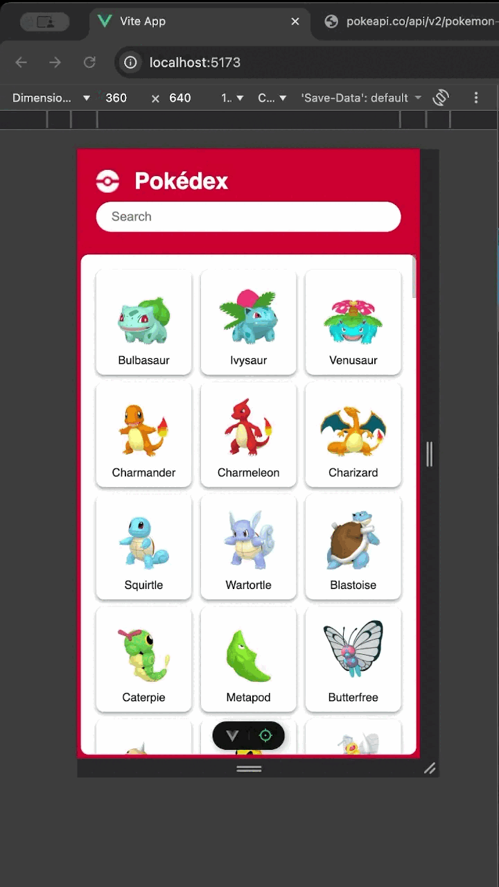

## SCSS (0.5u)

Om te zorgen dat Vue automatisch SCSS ondersteunt, moet de `sass`- of `sass-embedded`-package geïnstalleerd zijn. Dit kan gedaan worden via npm:

```sh
npm install -D sass-embedded
```

In Vue is het mogelijk om SCSS te gebruiken door simpelweg `lang="scss"` toe te voegen aan de `<style>`-tag. In de `PokemonTypeBadge.vue`-component wordt momenteel herhaaldelijk dezelfde CSS-code geschreven voor elk type. Deze CSS-regels kunnen via een `@each`-loop geschreven worden zodat de code compacter wordt.

Voor de wijziging:

```html
<style scoped>
  .type {
    padding: 0.25rem 0.5rem;
    border-radius: 1rem;
    text-align: center;
    font-weight: bold;
    text-transform: capitalize;
    color: var(--color-grayscale-white);
  }

  .type-normal {
    background-color: var(--type-normal);
  }

  .type-fighting {
    background-color: var(--type-fighting);
  }

  .type-flying {
    background-color: var(--type-flying);
  }

  .type-poison {
    background-color: var(--type-poison);
  }

  .type-ground {
    background-color: var(--type-ground);
  }

  .type-rock {
    background-color: var(--type-rock);
  }

  .type-bug {
    background-color: var(--type-bug);
  }

  .type-ghost {
    background-color: var(--type-ghost);
  }

  .type-steel {
    background-color: var(--type-steel);
  }

  .type-fire {
    background-color: var(--type-fire);
  }

  .type-water {
    background-color: var(--type-water);
  }

  .type-grass {
    background-color: var(--type-grass);
  }

  .type-electric {
    background-color: var(--type-electric);
  }

  .type-psychic {
    background-color: var(--type-psychic);
  }

  .type-ice {
    background-color: var(--type-ice);
  }

  .type-dragon {
    background-color: var(--type-dragon);
  }

  .type-dark {
    background-color: var(--type-dark);
  }

  .type-fairy {
    background-color: var(--type-fairy);
  }
</style>
```

Na de wijziging:

```html
<style scoped lang="scss">
  $type-colors: (
    normal: var(--type-normal),
    fighting: var(--type-fighting),
    flying: var(--type-flying),
    poison: var(--type-poison),
    ground: var(--type-ground),
    rock: var(--type-rock),
    bug: var(--type-bug),
    ghost: var(--type-ghost),
    steel: var(--type-steel),
    fire: var(--type-fire),
    water: var(--type-water),
    grass: var(--type-grass),
    electric: var(--type-electric),
    psychic: var(--type-psychic),
    ice: var(--type-ice),
    dragon: var(--type-dragon),
    dark: var(--type-dark),
    fairy: var(--type-fairy),
  );

  .type {
    padding: 0.25rem 0.5rem;
    border-radius: 1rem;
    text-align: center;
    font-weight: bold;
    text-transform: capitalize;
    color: var(--color-grayscale-white);

    @each $type, $color in $type-colors {
      &-#{$type} {
        background-color: $color;
      }
    }
  }
</style>
```

Het is mogelijk om dit concept verder door te trekken naar andere componenten waar herhalende CSS-regels aanwezig zijn, maar dit is optioneel. Vue stelt ons in staat om SCSS te gebruiken waar nodig, maar het is niet verplicht om dit overal toe te passen.

## Extra functionaliteit: Zoekfunctie (2u)

Er is een zoekbalk aanwezig in de ListView, maar deze werkt momenteel nog niet.

Implementeer de zoekfunctionaliteit zodat er gefilterd kan worden op naam.

### Zoekfunctionaliteit implementeren

**State toevoegen voor de zoekterm**

Voeg een `searchTerm`-state toe aan de Pinia store. Deze zal de waarde van de zoekbalk bevatten.

```js
const searchTerm = ref('');
```

**Getter toevoegen voor gefilterde lijst**

Voeg een getter toe aan de store die de lijst met Pokémon filtert op basis van de `searchTerm`.

```js
const filteredPokemonList = computed(() => {
  return pokemonList.value.filter((pokemon) =>
    pokemon.name.toLowerCase().includes(searchTerm.value.toLowerCase()),
  );
});
```

**Zoekterm bijwerken vanuit de PokemonListHeader**

Bind de waarde van de zoekbalk aan de `searchTerm` in de store. Gebruik hiervoor een `v-model`.

```html
<script setup>
  import { usePokemonStore } from '@/stores/pokemon';
  import { storeToRefs } from 'pinia';

  const pokemonStore = usePokemonStore();
  const { searchTerm } = storeToRefs(pokemonStore);
</script>

<template>
  <header>
    <div class="header-row">
      
      <h1>Pokédex</h1>
    </div>
    <input name="search" type="text" placeholder="Search" v-model="searchTerm" />
  </header>
</template>
```

**Gefilterde lijst gebruiken in de ListView**

Gebruik de `filteredPokemonList` in plaats van de originele `pokemonList` om de lijst met items weer te geven.

```js
const { filteredPokemonList } = storeToRefs(pokemonStore);
```

Pas de `v-for`-directive aan:

```html
<PokemonListItem
  v-for="pokemon in filteredPokemonList"
  :key="pokemon.id"
  :id="pokemon.id"
  :name="pokemon.name"
/>
```

**Reset de zoekbalk bij het laden van de ListView**

Om ervoor te zorgen dat de zoekbalk leeg is wanneer de ListView wordt geladen, kan de `searchTerm` worden gereset in de `onMounted`-hook van de ListView.

```js
onMounted(async () => {
  searchTerm.value = '';
  await fetchPokemonList();
});
```

## Resultaat

| ListView met 151 Pokémon                                          | Zoekfunctie in actie                                                     |
| ----------------------------------------------------------------- | ------------------------------------------------------------------------ |
|  |  |
